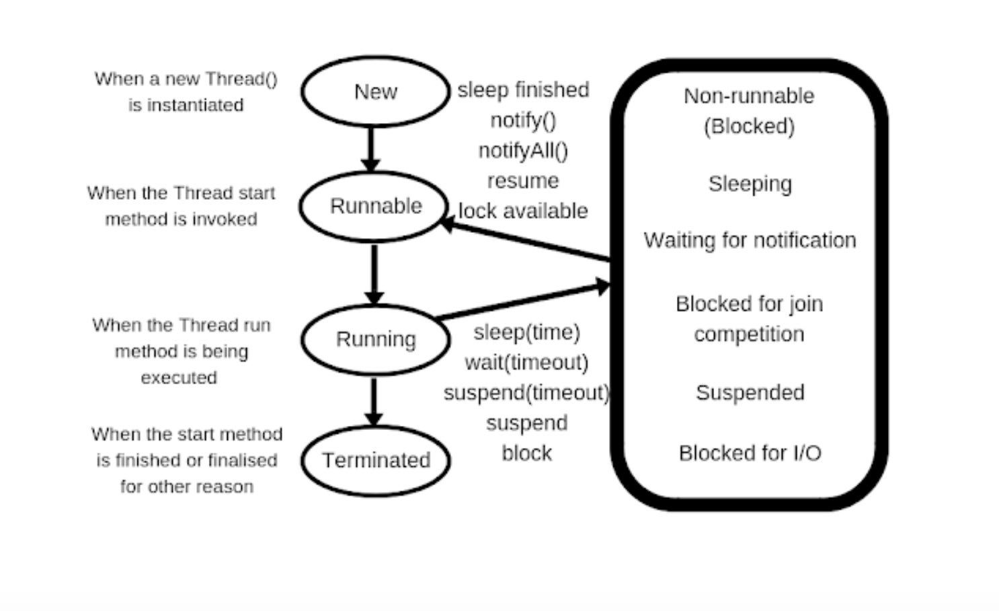

## 1주차

- JVM에서 스레드 동작하는 방식
- 컨텍스트 스위칭 비용이란?
- 병렬 프로그램 시 알아야할 인프라 리소스

---

## JVM에서 스레드 동작하는 방식

JVM(Java Virtual Machine)에서 스레드는 운영 체제의 스레드와 밀접하게 연관되어 동작하며, JVM 내에서의 스레드 동작 방식과 원리를 이해하는 것은 멀티스레드 프로그래밍에서 중요한 요소이다.
JVM은 플랫폼 독립적 자바 프로그램의 실행을 가능하게 한다.
JVM은 크게 클래스 로더 시스템, 런타임 데이터 영역, 실행 엔진으로 구성된다. 이 중 런타임 데이터 영역은 자바 프로그램 실행 중 생성되는 데이터를 저장하는 공간이다.

왜냐하면 JVM의 런타임 데이터 영역은 프로그램의 실행 상태를 관리하고, 메모리 관리의 핵심을 담당하고 있다. 이 영역은 메소드 영역, 힙 영역, 스택 영역, PC 레지스터, Native 메소드 스택으로 구분된다.

메소드 영역에는 클래스 정보, 상수, 정적 변수 등이 저장되며, 힙 영역은 객체와 배열이 할당되는 곳입니다. 스택 영역은 스레드마다 생성되며 메소드 호출과 로컬 변수 등을 저장합니다.

자바는 멀티 스레딩을 지원하는 언어입니다. 멀티 스레딩은 여러 스레드가 동시에 작업을 수행할 수 있게 해주며, 멀티 스레드 환경에서 각 스레드는 자신만의 스택 영역을 가지지만, 힙 영역과 메소드 영역은 모든 스레드가 공유한다. 이는 스레드 간의 데이터 공유와 동시성 제어를 가능하게 한다.

왜냐하면 멀티 스레딩은 동시에 여러 작업을 처리할 수 있기 때문에, I/O 작업이 많거나 복잡한 계산이 필요한 애플리케이션에서 성능을 향상시킬 수 있다.

예를 들어, 웹 서버는 동시에 여러 클라이언트의 요청을 처리하기 위해 멀티 스레딩을 사용한다. 추후 VM을 사용할 수도 있지만, 내부에 멀티 스레딩에 대한 핸들링을 통해 정합성 또한 제어가 가능하여 성능 향상과 무결성, 일관성에 초점을 맞춰 개발할 수 있다.

1. 스레드의 생성과 관리
   이전에 실습한 내용으로 Thread, Runnable을 활용한 코드 참고.
   • 스레드 생성: JVM에서 Thread 클래스나 Runnable 인터페이스를 구현한 객체를 통해 스레드를 생성할 수 있다. 새로운 스레드가 생성되면 JVM은 운영 체제의 스레드 관리 API를 호출하여 운영 체제의 스레드를 할당한다.
   • 스레드 실행: 생성된 스레드의 start() 메서드를 호출하면 스레드는 RUNNABLE 상태로 진입하여 JVM에 의해 관리되기 시작한다. JVM은 운영 체제에 이 스레드를 등록하여 CPU 시간을 할당받을 수 있도록 한다.

2. 스레드 상태와 전환
   스레드는 생명 주기 동안 여러 상태를 거친다.

    •	NEW: 스레드가 생성되었지만 아직 실행되지 않은 초기 상태.
    •	RUNNABLE: 스레드가 실행 가능한 상태로, CPU를 할당받으면 코드가 실행되며, JVM은 스레드를 스케줄링하여 CPU 리소스를 할당합니다.
    •	BLOCKED: 다른 스레드에 의해 잠금이 걸린 객체를 기다리고 있을 때.
    •	WAITING: 특정 조건이 충족될 때까지 대기하는 상태로, wait(), join(), sleep() 메서드 등이 호출되면 이 상태가 된다.
    •	TERMINATED: 스레드의 실행이 완료되거나 종료되었을 때의 상태이다.

3. JVM의 스레드 스케줄링

   • 스레드 우선순위: 각 스레드는 우선순위(priority) 속성을 가지고 있으며, JVM은 우선순위에 따라 스레드 스케줄링을 수행할 수 있다. 다만, 우선순위가 높은 스레드가 반드시 우선적으로 실행되는 것은 내부 운영 체제의 정책에 따라 달라질 수 있다.
   • 타임 슬라이스: JVM은 운영 체제의 타임 슬라이스(time slice) 정책을 따라 각 스레드에 CPU 시간을 할당하며, 해당 시간이 만료되면 다른 스레드가 CPU를 사용할 수 있도록 한다. 이 방식은 선점형 스케줄링(preemptive scheduling) 방식으로 이루어진다.
   • 스레드 동시성 제어: JVM은 동기화 블록(synchronized 키워드)이나 Lock API를 통해 스레드 간의 동시성 제어를 합니다.(요즘엔 synchronized 키워드 안하고 Redission? Lettuce로도 제어를 한다고 함) 동기화는 특정 코드 블록에서 하나의 스레드만 접근할 수 있도록 잠금을 설정하여 데이터 일관성을 유지한다. (중요!)

4. 메모리 모델과 스레드 간 통신

   • JVM 메모리 모델: JVM은 스레드마다 별도의 스택(stack) 메모리를 가지고 있으며, 이 스택에는 각 스레드의 지역 변수 및 호출 스택이 저장된다. 반면, 모든 스레드가 공유하는 힙(heap) 메모리에는 객체 인스턴스와 클래스 데이터가 저장된다. // 면접 질문에 가끔 나옴
   • 가시성(Visibility): 한 스레드에서 변경된 메모리 상태가 다른 스레드에게 즉시 보장되지 않을 수 있다. volatile 키워드를 사용하거나 synchronized 블록을 통해 메모리 가시성을 확보할 수 있다고 한다.
   • 공유 자원과 동기화: JVM은 스레드가 공유하는 자원에 동시 접근할 때 synchronized 키워드를 통해 동기화하며, 이를 통해 데이터의 일관성을 유지한다.

5. 스레드 풀(Thread Pool)과 Executor

   • 스레드 풀: 자바에서는 Executor 프레임워크를 통해 스레드 풀을 관리할 수 있다. 스레드 풀은 미리 생성된 스레드를 재사용하여 스레드 생성 및 소멸에 드는 비용을 줄일 수 있다.
   • ExecutorService: ExecutorService는 다양한 유형의 스레드 풀을 제공하며, 여러 작업을 동시에 실행할 수 있도록 한다. 이를 통해 작업이 완료될 때까지 대기하거나, 특정 작업의 종료를 기다리는 등 다양한 기능을 제공한다.

6. JVM의 가비지 컬렉터와 스레드

   • 가비지 컬렉션의 동작 방식: JVM은 힙 메모리 관리를 위해 가비지 컬렉터(GC)를 실행하며, 이는 별도의 스레드로 작동한다. GC 스레드는 특정 주기에 따라 힙 메모리를 스캔하여 사용되지 않는 객체 인스턴스를 제거하며, 힙 메모리를 최적화한다.
   • GC 스레드와 멀티스레딩: GC 스레드도 JVM 내의 하나의 스레드로 작동하며, GC의 영향을 최소화하기 위해 다양한 GC 정책과 알고리즘이 사용되고 있다. 다중 스레드를 활용하여 가비지 컬렉션 작업을 빠르게 처리할 수도 있다한다.

7. JVM의 스레드 관리 최적화

   • 스레드 덤프: JVM은 특정 시점의 스레드 상태를 분석하기 위해 스레드 덤프(thread dump)를 제공한다. 스레드 덤프는 현재 실행 중인 각 스레드의 상태와 자원 잠금 정보를 포함하며, 이를 통해 교착 상태(deadlock)나 성능 병목을 분석할 수 있다한다. (이건 좀 흥미롭네요)
   • JVM 파라미터: -Xss 옵션을 통해 각 스레드 스택의 크기를 조절할 수 있으며, 이는 특정 애플리케이션에서 스택 오버플로우를 방지하거나 메모리 효율성을 높이기 위해 조정할 수 있다. (jib 컨테이너에서도 메모리에 대한 크기 조정이 가능한데 이것도 그러한지? 잘 모르겠습니다...)

---

## 컨텍스트 스위칭 비용이란?

우선 컨텍스트 스위칭이 뭘까?
컨텍스트라는 것은 프로세스/스레드의 상태를 의미할 수 있다.
그럼 스위칭이라는 워딩은 교체이라는 뜻으로 프로세스나 스레드의 교체에 대한 의미로 볼 수 있다.

#### 왜 컨텍스트 스위칭을 할까?

간단하다. 여러 프로세스와 스레드를 동시에 실행시키게 하고 필요한 경우에 실행시키게 하기 위해서이다.
빠른 성능을 위해 과도하게 컨텍스트 스위칭을 하게 되면 스레드가 계속 생성될 수도 있고, 트래킹하기 어려워진다.
배보다 배꼽이 더 커질 수도 있다는 뜻이다.

#### 컨텍스트 스위칭 과정

우선 프로세스, 스레드 별도의 스위칭 과정으로 분리할 것이다.

**프로세스 컨텍스트 스위칭 과정**

    1.	상태 저장: 현재 실행 중인 프로세스의 레지스터, 프로그램 카운터, 메모리 매핑 정보 등의 상태를 PCB(Process Control Block)에 저장한다.
    2.	상태 변경: 스케줄러가 새롭게 실행할 프로세스를 선택하고, CPU 컨텍스트를 변경하여 해당 프로세스의 PCB에 저장된 정보를 불러오고
    3.	메모리 매핑: 프로세스 간 주소 공간이 다르므로, 메모리 매핑 정보를 다시 설정한다.
    4.	실행: 선택된 프로세스가 CPU에 의해 실행된다.

**스레드 컨텍스트 스위칭 과정**

스레드의 경우 같은 프로세스 내에서 컨텍스트가 변경되기 때문에 주소 공간을 공유한다. 따라서 메모리 매핑 과정이 필요하지 않아 스레드 간 상태 정보만 변경하면 된다.

### 그래서 비용은?

컨텍스트 스위칭에는 다음과 같은 비용이 발생한다.

    •	CPU 자원 소모: 상태 저장 및 복구 작업이 CPU 자원을 소모하여 실행 중인 프로세스나 스레드가 일시 중단된다.
    •	메모리 캐시 미스: 스위칭이 발생하면 이전 작업의 캐시 데이터가 무효화되고, 새로운 작업의 캐시를 다시 로드해야 하므로 캐시 미스가 증가할 수 있다.
    •	시간 지연: 상태 전환과 스케줄링 과정 자체가 시간이 걸리므로, 빈번한 스위칭은 시스템 성능을 저하시킬 수도 있다.

과도한 컨텍스트 스위칭은 이 비용이 누적되어 시스템 성능에 악영향을 미칠 수 있으므로, 필요할 때만 수행되도록 스케줄링 최적화가 중요하다.

---

## 병렬 프로그램 시 알아야 할 인프라 리소스
