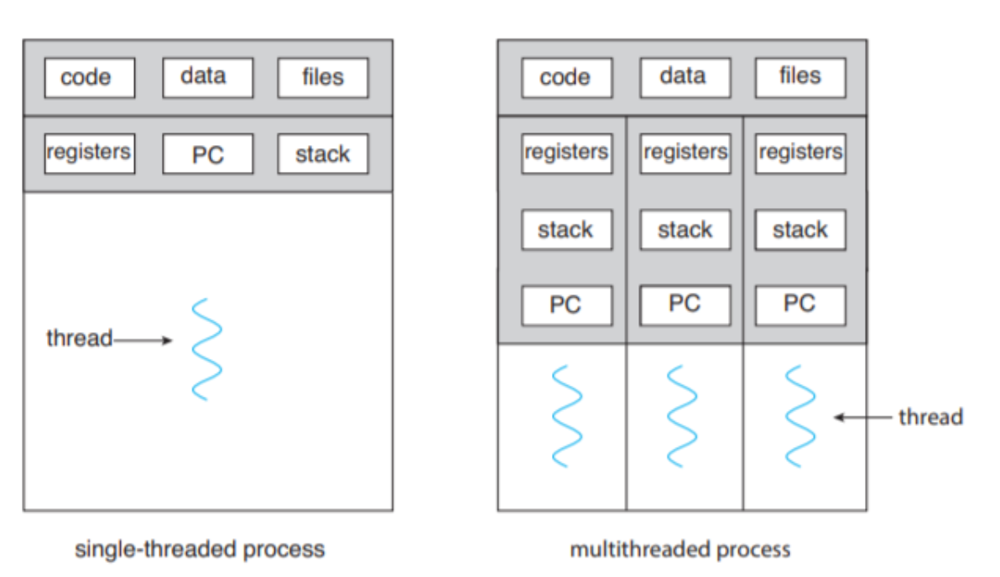

# week 1

### What is thread?

- 왜 스레드라는 개념이 만들어져야했을까?
    - 하나의 프로세스 안에서 여러 작업을 동시에 처리하고 싶기 때문
- 그렇지만 스레드는 사실 본질적으로 프로세스와 같다.
- 스레드는 각자의 program counter 와 register 값들을 갖고 있다. 때문에 여러 스레드가 하나의 core 에서 실행되어야 할 경우 context switching 이 일어난다.
- 스레드 간의 context switching 은 프로세스 간의 그것과 아주 비슷하다. 코어를 양보할 스레드의 실행 상태는 저장되어야 하고 코어를 차지할 스레드의 실행 상태는 다시 복구되어야한다. 이는 프로세스의 context switching 과정과 동일하며 상태를 저장하는 구조체를 부르는 이름만 다르다. (PCB, TCB)
    
    
    
- 유일한 차이는 스레드는 프로세스와 다르게 여럿이서 **하나의 주소공간을 공유**하고 stack 이라는 각자의 공간을 가진다는 것
    
    
    
- 스레드끼리는 동일한 주소공간을 사용하기에 새롭게 생성하더라도 페이지 테이블 복사가 필요 없어서 생성 시간이 매우 짧고, 메모리를 공유하므로 이를 활용한 협력적인 병렬 코드를 작성할 수 있다.

### 프로세스와 스레드의 차이

- 앞서 말했듯 프로세스와 스레드는 별반 다르지 않다.
- 리눅스에서 새로운 프로세스를 생성하는 시스템 콜인 `fork()` 와 스레드를 생성하는 시스템 콜인 `pthread_create()` 는 결국 내부적으로 `clone()` 시스템 콜을 호출하게 되는데, `clone()` 시스템 콜은 파라미터를 통해 자식 프로세스가 부모와 주소공간을 공유할 수 있는지의 여부를 조절할 수 있다.
    
    
    
- POSIX `pthread_create()`  구현부를 보면 아래처럼 `clone()` 시스템 콜 호출 시 사용할 플래그들을 미리 정의해놓았는데, 이 플래그들을 사용해서 같은 `clone()` 이지만 프로세스가 아닌 스레드를 만들 수 있는걸로 보인다.
    
    
    
- https://github.com/torvalds/linux/blob/master/kernel/fork.c#L2694
- 스레드를 생성한다고 하면 보통 커널 스레드를 말하는데, 커널 스레드는 각자 PID 를 가지고 있으며 PPID 는 부모 프로세스 PID 가 된다. 그래서 ps 명령어로 터미널에서 프로세스와 동일하게 조회 가능하다.
- 우리가 애용하는 JVM 의 자바 스레드는 커널 스레드와 1:1 매핑된다. 자바에서 Thread 를 생성하면 커널 스레드가 새롭게 하나 생성되는 것이다.
- 또 우리가 너무 좋아하는 스프링(tomcat) 의 경우 그냥 띄우기만 해도 수십개의 스레드가 생성될텐데 이게 다 터미널에서 조회가 될까?
    
    
    

### JVM 스레드 구조

- 자바도 병렬 처리를 위해 스레드를 기본적으로 제공한다.
- 앞서 말했듯 대부분의 JVM 구현체는 1:1 스레드 모델을 채택했는데, 자바의 `java.lang.Thread` 인스턴스 하나가 OS 의 커널 스레드 하나에 직접 매핑된다는 의미이다.
- JVM 의 스레드 구조는 간략히 나타내면 아래와 같다. (사진은 JVM 의 전체적인 메모리 구조)
    
    
    
- 모든 Thread는 자신만의 Stack 과 Register 값을 갖는다. (이 Register 값은 아마 JVM 명령어 주소를 저장할 듯)
- JVM 은 Stack에 대해 pop 이나 push 동작만 수행할 수 있다.
- Stack의 각 원소를 Stack Frame 이라고 부르며, 메소드 하나를 실행할 때 마다 새롭게 생성되며(push) 종료 시 사라진다(pop).
- Stack Frame은 지역변수 Array, Operand Stack, 상수풀 레퍼런스 로 구성되어 있다.(위 사진에서 각각 LVA, OS, FD)

### JVM 에서 스레드를 효율적으로 다루기 위한 방법

- 개인적으로 자바를 사용하면서 스레드를 직접 생성하고 다뤄야하는 상황은 잘 없었다.
- 보통 기존에 존재하는 여러가지 도구를 활용해서 동시성 로직을 구현하는데, 자바의 모든 동시성 관련 도구는 [여기](https://docs.oracle.com/javase/8/docs/api/java/util/concurrent/package-summary.html)에 담겨있다.
    
    
    
- 이 중 가장 흔히 쓰이는 것 몇가지를 뽑자면 `ExecutorService`, `Future`, `ConcurrentHashMap`, `BlockingQueue` 정도가 되겠다.
- 이들 각각에 대한 자세한 설명은 다음 주차에 계속

### JVM 에서 병렬 프로그래밍의 미래

- WIP