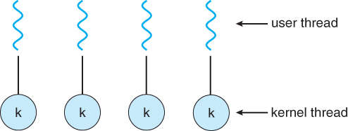
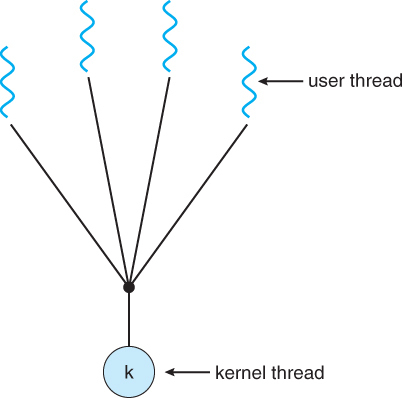
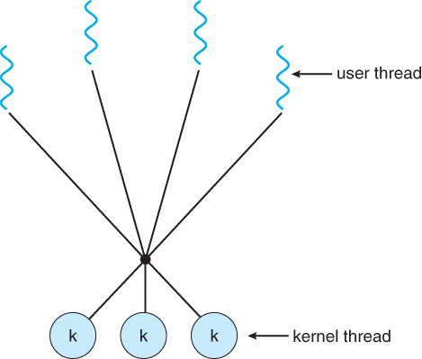
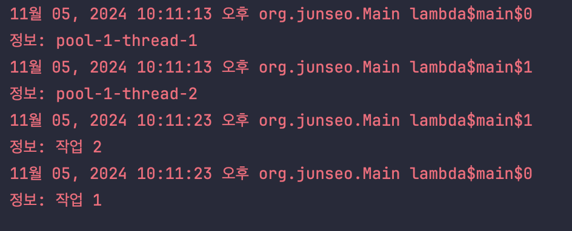

# 1주차. Thread

# Thread

## 개념적 이해

- **커널 스레드 ( os 스레드 / native 스레드 )**
    - CPU에서 실행되는 작업 단위 (CPU 스케쥴링 단위)
    - os스레드의 컨텍스트 스위칭에는 커널이 개입하게 돼서 비용이 발생함
- **유저 스레드**
    - 스레드 개념을 프로그래밍 레벨에서 추상화한 것 ex) 자바의 Thread 객체
    - 사용자 단에서 생성 및 관리되는 스레드
        - 커널이 따로 관리하지 않고, 커널은 이 스레드에 대해 알지 못함
    - cpu에서 실행되려면 커널 스레드와 연결되어야함

### os 레벨 스레드와 유저 레벨 스레드 연결 방식 3가지

1. **One-to-One model**

   
    - 유저 레벨 스레드, 커널 스레드 1:1 매칭
    - 스레드 관리(스케쥴링 등)을 커널에 맡김
    - 커널 스레드가 여러개기 때문에 멀티코어 활용 가능
    
   자바(jdk 버전 1.3 이후)는 해당 방식을 사용함


2. **Many-to-One model**

   

    1. 여러 개의 유저 레벨 스레드가 하나의 커널 스레드와 연결됨
    2. 커널 레벨에서의 컨텍스트 스위칭이 일어나지 않아서 컨텍스트 스위칭의 리소스 덜 듦
    3. 멀티코어 활용 불가
    4. 커널 스레드가 block 되면 연결된 전체 유저 스레드가 block 됨


3. **Many-to-Many model**

   

    1. 여러 개의 유저 레벨 스레드가 여러 개의 커널 스레드와 연결됨
    2. 멀티 코어 활용 가능
    3. 구현 복잡함


## Java 와 Thread

- 자바를 실행할 때 필요한 스레드는 JVM에 의해 관리됨
- JVM이 시작되면 하나의 non-daemon 스레드 (main 스레드)가 생성되고 실행됨


    daemon vs non-daemon 스레드
    
        메인 스레드와 메인 스레드에서 생성된 스레드를 제외한 모두가 데몬 스레드
    
    daemon thread: Normal Thread의 작업을 돕는 보조 역할을 담당하는 스레드
    
        - ex) gc, 네트워크 리스너, 백업 등 백그라운드 태스크를 실행하는 스레드
    
        프로그램이 종료될 때 자동으로 종료됨


## 객체 이해

### Thread  (java.lang)

> 스레드를 나타내는 클래스

- **public synchronized void** start()
  - 스레드 생성 및 작업 실행
  - 내부 동작
      ```java
      public synchronized void start() {
          // 스레드가 실행 가능한지 검사
          if (threadStatus != 0)
              throw new IllegalThreadStateException();
        
          // 스레드 그룹에 현재 스레드 추가
          group.add(this);
        
          boolean started = false;
          try {
              // os 스레드 생성 및 실행
              start0();
              started = true;
          } finally {
              try {
                  if (!started) {
                      group.threadStartFailed(this);
                  }
              } catch (Throwable ignore) {
                
              }
          }
      }
      ```

    - 커널 스레드를 생성해서 작업을 수행
        - 해당 메서드를 호출한 스레드 외에 작업을 수행하는 스레드가 더 생기게 되는 것
    - 내부적으로 start0() 메서드를 호출하여 커널 스레드 생성 및 자바 스레드와 연결
        - start0()은 JVM 외부 라이브러리에 정의되어 있음 ( 호출을 위해 JNI 활용 )

  ### JNI (Java Native Interface)

    > 다른 언어들로 작성된 JVM 외부의 라이브러리들을 호출하거나 반대로 호출되는 것을 가능하게 하는 인터페이스

    **start0()**

    JNI를 활용해서 JVM 외부 라이브러리의 기능 사용

    JDK 의 java/base/share/native/libjava/Thread.c에 정의 되어 있음

    system call을 호출해서 커널 레벨 스레드를 생성하고 자바 Thread와 연결

    [라이브러리 코드 분석 참조](https://letsmakemyselfprogrammer.tistory.com/98)

      - +) 이 외부 라이브러리는 어떻게 쓸 수 있게 되는가
          - static { registerNatives(); }
              - 클래스가 로드될 때 Thread 클래스에서 사용되는 네이티브 메서드들을 JVM에 등록


- Thread가 가질 수 있는 상태
    - **NEW**
        - 스레드 실행하기 전
    - **RUNNABLE**
        - JVM이 스레드를 실행 중인 상태
    - **BLOCKED**
        - 스레드가 접근하려는 곳을 다른 스레드가 이미 차지한 상태여서 대기 중인 상태
    - **WAITING**
        - 무기한으로 다른 스레드가 특정 작업을 할 때까지 기다리는 상태
    - **TIMED_WAITING**
        - 특정 기간동안 다른 스레드가 특정 작업을 할 때까지 기다리는 상태
    - **TERMINATED**
        - 종료된 상태


# Runnable (java.lang)

> **스레드에서 실행될 동작을 정의**하는 함수형 인터페이스

- **private abstract void** run()
    - 실행될 동작을 정의하는 메서드


**예시 코드**

```java
System.out.println(Thread.currentThread().getName());

Thread thread = new Thread(() -> System.out.println(Thread.currentThread().getName()));

thread.start();

/* 결과
 *
 * main
 * Thread-0
 *
 */
```

---

### **Thread, Runnable의 한계점**

- 애플리케이션 코드가 지나치게 저수준 API에 의존함
    - 스레드 직접 생성, 생성한 스레드 하나하나 직접 관리
- 작업(Runnable) 실행의 결과를 리턴하지 못함
    - private abstract **void** run()

Thread, Runnable의 한계점을 극복하고자
Java 5부터 **`Callable`**, **`Future`**, **`Executor`**, **`ExecutorService`** 등이 등장

- 스레드 생성/관리를 추상화
    - 효율적으로 스레드를 관리하고 생성할 수 있도록 Executor, ExecutorService가 스레드 생성 및 관리를 맡음
- 동작 실행 결과 리턴
    - Callable 인터페이스는 동작의 결과를 반환할 수 있음

# Callable (java.util.concurrent)

> **스레드에서 실행될 동작을 정의**하는 함수형 인터페이스 ( 역할은 Runnable과 일치 )

- **V** call() **throws** Exception
    - 실행될 동작을 정의하는 메서드

    → 결과 리턴 가능

    → 체크드 익셉션 발생 가능

# Future<V> (java.util.concurrent)

> 언젠가 완료될 **작업의 결과 정보**를 위한 인터페이스. 비동기 작업 결과를 나타냄.

- **boolean** isDone()
    - 작업이 끝났는가 확인
- **V**  get() **throws** InterruptedException, ExecutionException;
    - 작업이 끝나기를 기다리고 작업의 결과 받기 (이미 끝났다면 바로 리턴)
        - get() 메서드로 “완료된 작업”의 결과를 받을 수 있음
        - 완료되지 않았다면 완료 될 때까지 block
- **boolean** cancle()
    - 작업 취소

# Executor (java.util.concurrent)

> 등록된 **Runnable 테스크 실행**을 위한 인터페이스
작업 등록이 아닌 **작업 실행**만을 책임짐

- **void** execute(Runnable command)
    - 주어진 테스크(command)를 **언젠가 실행**하는 메서드
        - 테스크는 새로운 스레드 / 풀에 있는 스레드 / 실행을 호출한 스레드에서 실행 가능함 (구현체가 정할 수 있음)
        - ex) ThreadPoolExecutor 경우 남은 스레드 개수를 계산하고, 스레드를 할당하는 등의 로직이 구현 

# ExecutorService (java.util.concurrent)

> Executor를 상속 받아 **작업 등록을 책임지며, 작업 실행**도 책임지는 인터페이스
여러 비동기 작업들의 상황을 추적(Future 활용) 및 관리할 수 있음


주로 ThreadPool 구현을 위해 사용됨

- **라이프사이클 관리**
    - shutdown()
        - 더이상 작업 기다리지 않음을 설정
            - 해당 메서드 호출 안 하면 계속 다음 작업을 기다림
        - 등록된 작업들 모두 실행 후 종료함
    - shutdownNow()
        - 이미 등록된 작업들도 종료하며 즉시 종료함


- **작업 관리**
    - **<T> Future<T>** submit( … )
        - 내부적으로 execute()를 호출하여 주어진 **언젠가는 완료될 작업**(Runnable 또는 Callable)**의 결과를 나타내는 Future 객체를 반환**

    - **<T> List<Future<T>>** invokeAll( … )  **throws** InterruptedException
        - 주어진 **작업들을 모두 완료(blocking)**하고, 그 결과들( List<Future<T>>)을 반환
  - **AbstractExecutorService의 invokeAll**
      ```java
    public <T> List<Future<T>> invokeAll(Collection<? extends Callable<T>> tasks)
          throws InterruptedException {
          if (tasks == null)
              throw new NullPointerException();
          ArrayList<Future<T>> futures = new ArrayList<>(tasks.size());
          try {
              // 주어진 테스크 모두 실행
              for (Callable<T> t : tasks) {
                  RunnableFuture<T> f = newTaskFor(t);
                  futures.add(f);
                  // 스레드 풀에 스레드가 남아있다면 각 스레드에 동작이 동시에 실행됨
                  execute(f);
              }
              for (int i = 0, size = futures.size(); i < size; i++) {
                  Future<T> f = futures.get(i);
                  if (!f.isDone()) {
                      // 작업이 끝나기를 기다리고 작업의 결과 가져오기
                      try { f.get(); }
                      catch (CancellationException | ExecutionException ignore) {}
                  }
              }
              return futures;
          } catch (Throwable t) {
              cancelAll(futures);
              throw t;
          }
      }
      ```

    - **<T> T** invokeAny()
        - 주어진 작업들 중 가장 빨리 완료된 하나의 결과 ( Future ) 반환


**invokeAll 동작 예시 코드**
    
```java
// 스레드 2개를 갖는 스레드 풀 생성
ExecutorService threadExecutor = Executors.newFixedThreadPool(2);

// ExecutorService에 맡길 작업들 정의
ArrayList<Callable<Integer>> callableArrayList = new ArrayList<>();

// 첫 번째 작업
callableArrayList.add(() ->
{
  try {
      // 스레드 명 출력 후 10초 block
      logger.info(Thread.currentThread().getName());
      Thread.sleep(10000L);
  } catch (InterruptedException e) {
      throw new RuntimeException(e);
  }
  logger.info("작업 1");
  return 1;
});

// 두 번째 작업
callableArrayList.add(() -> {
  try {
      // 스레드 명 출력 후 10초 block
      logger.info(Thread.currentThread().getName());
      Thread.sleep(10000L);
  } catch (InterruptedException e) {
      throw new RuntimeException(e);
  }
  logger.info("작업 2");
  return 2;
});

threadExecutor.invokeAll(callableArrayList);

threadExecutor.shutdown();
```

**결과**

ExecutorService가 내부적으로 스레드 두 개에 주어진 두 가지 동작을 실행, 총 10초 소요



---

# Async
> Spring Framework에서 비동기 작업을 손쉽게 구현할 수 있도록 하는 기능

### 비동기 메서드

```java
public class EmailService {
	// executor 명시 안 할시 디폴트로 SimpleAsyncTaskExecutor 사용
	@Async("executor명")
	public void sendMail() {
		System.out.println(Thread.currentThread().getName());
	}
}
```

### 비동기 메서드 호출부

```java
@RequiredArgsConstructor
public class AsyncService {
	public final EmailService emailService;
	
	public void asyncCall() {
		System.out.println(Thread.currentThread().getName());
		emailService.sendEmail();
		emailService.sendMailWithCustomThreadPool();
	}
}
```

프록시 객체를 활용해서 비동기 작업이 일어나게 됨
(Spring이 AsyncService에 EmailService를 주입할 때 EmailService 자체가 아니라, EmailService를 프록시 객체로 감싸서 주입함)
CompletableFuture를 활용한다고 하는데.. 시간이 부족하여..... 더 자세한 설명은 다음주까지 채워보겠습니다...


**Future의 한계**

- 외부에서 완료시킬 수 없음. get의 타임아웃 설정으로만 완료 가능함
- 블로킹 코드인 get()을 통해서만 이후 결과 처리 가능
- 여러 Future 조합 불가

이를 해결하기 위해 Java 8부터 `CompletableFuture`가 생김

# CompletableFuture (java.util.concurrent)

> Future, CompletionStage 인터페이스를 구현하는 클래스
외부에서 완료시킬 수 있고 콜백 등록 및 Future 조합 가능

주요 기능
- **비동기 작업 실행**

  기본적으로 ForJoinPool.commonPool 에서 스레드 얻어서 실행 → ExecutorService를 파라미터로 넘기면 원하는 스레드 풀 사용 가능

    - runAsync()
        - 반환값 없는 경우
    - supplyAsync()
        - 반환값 있는 경우
        - 예시 코드

            ```java
            void test() throws ExecutionException, InterruptedException {
            	CompletableFuture<String> future = CompletableFuture.supplyAsync(() -> {
            			return Thread.currentThread().getName();
            	});
            	
            	System.out.println(future.get());
            }
            ```

- **작업 콜백**
    - thenApply()
        - 반환값을 받아서 다른 값 반환
        - 예시 코드
            ```java
            void test() throws ExecutionException, InterruptedException {
            	CompletableFuture<String> future = CompletableFuture.supplyAsync(() -> {
            		return Thread.currentThread().getName();
            	}).thenApply(s -> {
            		return s.toUpperCase();
            	});
            }
            ```
    - thenAccept()
        - 반환 값 받아서 처리하지 않고 값 반환 안 함
    - thenRun()
        - 반환 값 받지 않고 다른 작업 실행

- **작업 조합**
    - thenCompose()
        - 두 개의 작업 이어서 실행하도록 조합, 앞선 작업의 결과를 받아서 이용 가능
        - 코드
            ```java
            void test() throws ExecutionException, InterruptedException {
            	CompletableFuture<String> me = CompletableFuture.supplyAsync(() -> {
                         return "I'm";
            	});
            	
            	CompletableFuture<String> future = me.thenCompose(this::junseo);
            	System.out.println(future.get());
            	// I'm Junseo
            }
            
            private CompletableFuture<String> junseo(String message) {
            	return CompletableFuture.supplyAsync(() -> {
                         return message + " Junseo";
            	});
            }
            ```
    - thenCombine()
        - 두 작업 독립적으로 실행, 둘 다 완료되면 콜백 실행
    - allOf()
        - 여러 작업 동시 실행, 모든 작업 결과에 콜백 실행
    - anyOf()
        - 여러 작업 중 가장 빨리 끝난 하나의 결과에 콜백 실행

# ThreadLocal

> **스레드 단위** 로컬 변수를 제공하는 객체

Spring Security의 유저 정보처럼, 스레드 단위로 알고 있어야 되는 정보를 저장할 수 있음

→ 해당 정보들은 Thread마다 들고 있는 **`ThreadLocalMap`**에 저장됨

- Thread
    ```java
    class Thread implements Runnable {
    	...
    	
      ThreadLocal.ThreadLocalMap threadLocals = null;
      
      ...
    }
    ```


**예시 코드**

```java
ThreadLocal<UserInfo> threadLocal = new ThreadLocal<UserInfo>();

threadLocal.set(currentUser);

UserInfo userInfo = threadLocal.get();
```

**스레드 단위 로컬 변수 저장 방법**

1. ThreadLocal 객체 생성
2. ThreadLocal.set() → 현재 스레드의 로컬 변수에 값 저장
    - 내부적으로는 해당 스레드의 `ThreadLocalMap`에 정보 저장

        ```java
        // ThreadLocal의 set()
        public void set(T value) {
            Thread t = Thread.currentThread();
            ThreadLocalMap map = getMap(t);
            if (map != null) {
                map.set(this, value);
            } else {
                createMap(t, value);
            }
        }
        ```

3. ThreadLocal.get() → 현재 스레드의 로컬 변수 값 읽기
    - 내부적으로는 해당 스레드의 `ThreadLocalMap`의 정보 조회

        ```java
        public T get() {
            Thread t = Thread.currentThread();
            ThreadLocalMap map = getMap(t);
            if (map != null) {
                ThreadLocalMap.Entry e = map.getEntry(this);
                if (e != null) {
                    @SuppressWarnings("unchecked")
                    T result = (T)e.value;
                    return result;
                }
            }
            return setInitialValue();
        }
        ```

4. ThreadLocal.remove() → 현재 스레드의 로컬 변수 값 삭제
    - 내부적으로는 해당 스레드의 `ThreadLocalMap`의 정보 삭제

        ```java
        public void remove() {
             ThreadLocalMap m = getMap(Thread.currentThread());
             if (m != null) {
                 m.remove(this);
             }
         }
        ```
