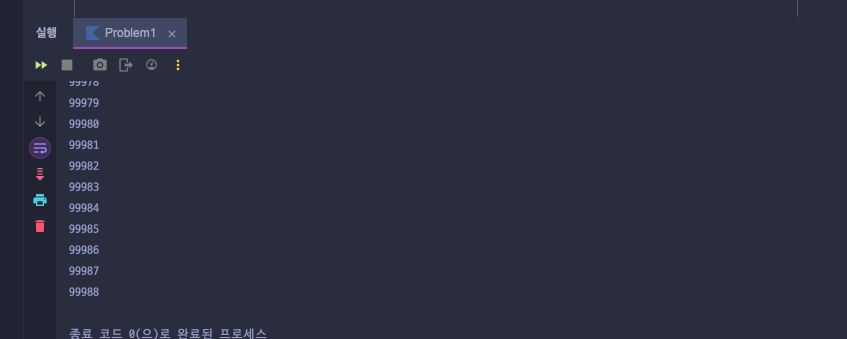

# Atomic (CAS), syncronized (lock), volatile 그 외 등등(FolkJoinPool, BlockingDeque, java.util.concurrent)으로 동기화

JVM 환경에서 제공되는 동기화 기법으로 `Atomic`, `syncronized`, `volatile`이 있습니다.
`volatile`, `syncronized`는 예약어로 사용이 가능한 키워드 이며, `Atomic`은 타입과 함께 클래스로 제공되고 있습니다.

동시성을 제어하기 위한 두 가지 원칙이 만족되어야 하는데, 바로 가시성과 동기화입니다.

#### 가시성은 왜지?
- 하나의 명령이 수행되었을 때, 스레드에서 공유 자원을 수정한 결과가 다른 스레드에게 보여지지 않는 경우 즉, 바로 반영되어서 보여줘야 하는 조건이 있습니다.

#### 동기화 관점
```kotlin
    companion object {
        private var count: Int = 0
        @JvmStatic
        fun main(args: Array<String>) {
            for (i in 0..99) {
                Thread {
                    for (j in 0..999) println(count++)
                }.start()
            }
        }
    }
```
volatile 키워드가 가시성을 높이는 데 도움이 되지만 , 여전히 다른 문제가 있습니다. 우리의 증가 예제에서 우리는 변수 count로 두 가지 연산을 수행합니다. 먼저, 우리는 이 변수를 읽고 새로운 값을 할당합니다. 즉, 증가 연산은 원자적이지 않습니다.

여기서 우리가 고민해야할 것은 `경쟁 조건(Race Condition)` 입니다 . 각 스레드는 먼저 값을 읽고 증가시킨 다음 다시 써야 합니다. 문제는 여러 스레드가 값으로 작업을 시작하고 다른 스레드가 쓰기 전에 읽을 때 발생합니다.

위 코드를 실행하면 99999에 도달하지 않고 언저리 쯤에 프로그램이 종료되는 것을 확인할 수 있습니다.


이런 결과도 있지만 중간에 99754, 99568, 99756 이러한 결과값을 볼 수도 있는데, 연산 속도가 빠른 스레드에서의 변경 사항이 연산 속도가 느린 스레드에서의 변경값으로 덮어 씌워지기도 한다.

결국 이런 식으로, 한 스레드가 다른 스레드가 쓴 결과를 오버라이드할 수 있습니다. synchronized 키워드는 이 문제를 해결할 수 있습니다. 하지만 이 접근 방식은 병목 현상을 일으킬 수 있으며, 이 문제에 대한 가장 우아한 해결책은 아닙니다.


---
## volatile

volatile 키워드는 메모리 가시성을 보장하기 위해 사용됩니다. 여러 스레드가 하나의 변수를 읽고 쓸 때, volatile 키워드를 사용하면 해당 변수의 값을 CPU 캐시가 아닌 메인 메모리에서 직접 읽고 쓸 수 있게 합니다. 이를 통해 변수의 최신 상태가 모든 스레드에서 바로 반영됩니다.

> 다만 오로지 Main! 메인 메모리에서만 저장하므로 CPU Cache Memory에서 이뤄지지 않습니다.

그리고 volatile은 원자성을 보장하지 않습니다. 예를 들어, volatile 변수에 대한 단순한 값 읽기와 쓰기는 안전하지만, 복잡한 연산 (예: 증가 연산)은 원자성을 보장하지 않기 때문에 안전하지 않습니다. 즉, 공유 자원에 있어서 Thread-safe가 올바르지 않다는 거죠. 이런 경우에는 synchronized나 Atomic 타입을 사용하는 것이 바람직할 수 있습니다.

예시 코드를 작성했는데, 

```kotlin
    @Volatile
    var count: Int = 0

    private fun incrementCount() {
        for (i in 0..9999) {
            count++
        }
    }

    companion object {
        @JvmStatic
        fun main(args: Array<String>) {
            val instance = Volatile1()

            // Create threads
            val thread1 = Thread { instance.incrementCount() }
            val thread2 = Thread { instance.incrementCount() }

            // Start threads
            thread1.start()
            thread2.start()

            // Wait for threads to finish
            thread1.join()
            thread2.join()

            // Print final count value
            println("Final count value: ${instance.count}")
        }
    }
```

이 코드의 막연한 예상 실행결과는 20000일테다.
그러나 20000에 도달하지 못하고 거의 19000대로 멈춰 프로그램이 종료될 것이다.
volatile은 메모리 가시성을 보장하여 count 변수의 최신 값을 모든 스레드가 볼 수 있도록 합니다. 하지만 count++ 연산은 읽기, 증가, 쓰기의 세 단계로 이루어져 있으므로, 이 연산 자체가 원자적으로 수행되지 않습니다. 따라서 두 스레드가 동시에 count 값을 읽고 동일한 값을 증가시키는 경우가 발생할 수 있으며, 이로 인해 값이 정확히 증가하지 않는 문제가 발생합니다.

volatile만으로는 원자성을 보장하지 않기 때문에, 이와 같은 증가 연산에는 앞으로 설명할 synchronized 또는 AtomicInteger와 같은 방법을 사용하는 것이 더 안전합니다.


---
## syncronized (lock)
synchronized 키워드는 JVM에서 임계 구역을 설정하여 여러 스레드가 동시에 접근할 때 동시성을 관리하는데 사용됩니다. synchronized 블록에 들어간 스레드는 락을 획득하여 다른 스레드가 해당 자원에 접근하지 못하게 합니다. 락이 해제되기 전까지는 다른 스레드가 접근할 수 없기 때문에 원자성(atomicity)을 보장할 수 있습니다.

이 방식은 두 가지 유형의 락을 제공합니다:
- 인스턴스 락: 인스턴스 메서드에 synchronized 키워드를 사용하여 객체 단위로 락을 거는 방식입니다.
- 클래스 락: 클래스 메서드에 synchronized 키워드를 사용하여 클래스 단위로 락을 거는 방식입니다.

이 방식의 단점은, 스레드가 락을 기다리는 동안 대기 상태에 놓여 자원 사용에 비효율적일 수 있다는 점입니다. 이러한 점은 `병목 현상`을 야기할 수 있습니다. 예를 들어, 긴 작업이 진행 중이면 다른 스레드들이 계속 대기해야 하는 상황이 발생할 수 있습니다.

```kotlin
package com.sipe.week2

class SynchronizedExample {
    private var count = 0 // 공유 자원

    // synchronized 블록을 사용하여 동기화
    @Synchronized
    fun incrementCount() {
        count++
    }

    fun getCount(): Int {
        return count
    }
}

fun main() {
    val example = SynchronizedExample()
    val thread1 = Thread {
        for (i in 0 until 10000) {
            example.incrementCount()
        }
    }
    val thread2 = Thread {
        for (i in 0 until 10000) {
            example.incrementCount()
        }
    }

    // 두 스레드를 시작하고 종료 대기
    thread1.start()
    thread2.start()
    thread1.join()
    thread2.join()

    // 최종 카운트 값을 출력
    println("최종 카운트 값: ${example.getCount()}")
}
```
예시 코드와 같이 원자성을 보장하기에 20000이라는 정상 값이 출력됩니다.

---
## Atomic (CAS)

Atomic 클래스는 Compare-And-Swap (CAS) 알고리즘 방식으로 정말 사전적 의미로 `원자성`을 제공합니다.
Atomic 변수는 원자성을 보장하는 변수라는 의미로, 기존에 원자성을 보장하였던 synchronized 키워드의 성능 저하 문제를 해결하기위해 고안된 방법이라고 합니다.

Atomic의 메서드들은 CPU가 제공하는 CAS 연산을 활용하여 락 없이 스레드 안전하게 값을 갱신할 수 있습니다. 대표적인 예로 AtomicInteger 클래스의 incrementAndGet() 메서드는 현재 값을 증가시키고 갱신된 값을 반환하면서도, synchronized 락을 사용하지 않기 때문에 성능상 이점을 제공합니다.

AtomicInteger의 incrementAndGet 메서드는 CAS (Compare-And-Swap) 알고리즘을 사용하여 원자적으로 값을 증가시키는 방식입니다. 이 메서드는 락을 사용하지 않고도 스레드 안전하게 동작할 수 있으며, 내부적으로 Unsafe 클래스의 메서드를 통해 메모리 레벨에서 직접 작업을 수행합니다.

```java
    public final int incrementAndGet() {
        // U (Unsafe 객체)를 사용하여 현재 값에 1을 더하고, 최종 결과를 반환
        return U.getAndAddInt(this, VALUE, 1) + 1;
    }

    @IntrinsicCandidate
    public final int getAndAddInt(Object o, long offset, int delta) {
        int v;
        do {
            // 현재 값을 읽어옴 (메모리 가시성 보장)
            v = getIntVolatile(o, offset);
        } while (!weakCompareAndSetInt(o, offset, v, v + delta));
        // 값을 읽고 난 후, CAS 연산을 통해 갱신이 성공할 때까지 반복
        return v;
    }

    @IntrinsicCandidate
    public native int getIntVolatile(Object o, long offset);

    // 예상된 값과 실제 값을 비교한 후 일치하면 값을 업데이트하고 true 반환
    @IntrinsicCandidate
    public final boolean weakCompareAndSetInt(Object o, long offset, int expected, int x) {
        return compareAndSetInt(o, offset, expected, x);
    }
```

CAS 알고리즘이란 현재 쓰레드가 존재하는 CPU 의 CacheMemory와 MainMemory에 저장된 값을 비교하여, 일치하는 경우 새로운 값으로 교체하고, 일치하지 않을 경우 기존 교체가 실패되고, 이에 대해 계속 재시도를 하는 방식이다. 이러한 방식은 고성능 환경에서 특히 유리하지만, 반복적인 실패가 발생할 수 있는 상황에서는 성능 저하를 유발할 수도 있습니다.(ABA 이슈라고도 한다)

---
이외에도 ForkJoinPool, BlockingDeque, 그리고 java.util.concurrent 패키지의 여러 클래스들이 동시성을 제어하는데 활용됩니다. 특히 ForkJoinPool은 큰 작업을 분할하여 병렬로 처리하는 데 적합하며, BlockingDeque는 스레드간 안전하게 데이터를 교환할 수 있는 큐 역할을 합니다. java.util.concurrent 패키지의 다양한 동기화 유틸리티는 복잡한 스레드 제어를 쉽게 만들어 줍니다.

이와 같은 동기화 기법들을 잘 활용하여 스레드 안전성을 보장하는 것은 멀티스레드 환경에서의 성능 향상에 매우 중요합니다.