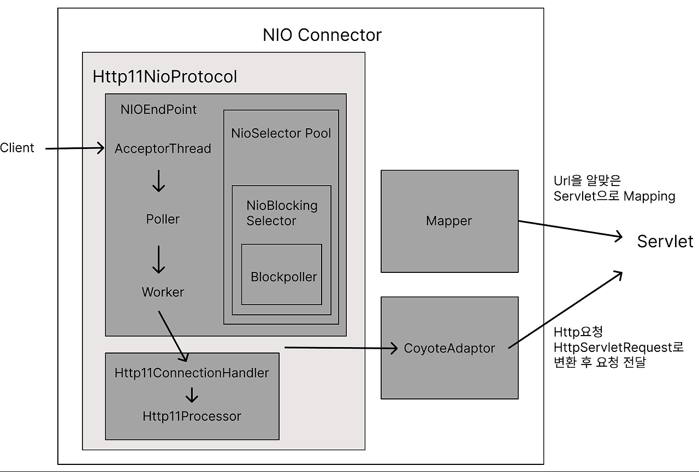

## Tomcat 네트워크 요청을 받아서, 스레드를 할당받고, 이게 스프링까지 넘어와서 어떤 식으로 스레드가 처리되는지?

Tomcat은 5 버전 이후로 NIO (Non-blocking I/O) Connector를 지원하기 시작했습니다. NIO Connector는 네트워크 요청을 비동기적으로 처리하기 위한 구조를 제공하여, 동시에 다수의 클라이언트 요청을 효율적으로 처리할 수 있게 합니다. 이 과정에서 Selector를 사용하여 하나의 스레드가 여러 소켓 채널을 모니터링하고, 필요한 작업이 발생할 때만 스레드를 할당합니다.

해당 과정은 Tomcat 5 버전  이후 Nio Connector 과정입니다.

**1. 클라이언트 요청 수신 및 Tomcat에서의 처리**
- 클라이언트가 HTTP 요청을 보내면, Tomcat 서버의 커넥터(NIO)가 요청을 수신합니다.
- 이 커넥터는 요청을 수신할 때 스레드 풀(Thread Pool)을 통해 스레드를 할당받아 요청을 처리할 준비를 합니다.
- 기본적으로 Tomcat은 Http11NioProtocol을 사용하여 NIO (Non-blocking I/O) 방식으로 요청을 수신하며, 네트워크 연결을 효율적으로 관리하기 위해 Connector와 Acceptor 스레드를 사용합니다. (Http11NioProtocol은 Non-blocking을 위해 HTTP/1.1을 지원하여 NioEndPoint, Acceptor, Poller를 초기화)
- 요청이 수신되면, 스레드 풀에서 대기 중인 Worker 스레드 중에서 Executor라는 스레드 풀을 사용해 하나를 할당하여 요청을 처리합니다.
  - Executor의 기본 스레드 수, 최대 스레드 수, 대기 큐 사이즈 등의 설정에 따라 스레드가 관리됩니다.

**2. Acceptor Thread가 요청 수락**
- Acceptor Thread는 클라이언트로부터 들어오는 요청을 수락하는 역할을 합니다. 이 스레드는 서버 소켓을 모니터링하여 새로운 연결 요청이 들어오면 해당 요청을 처리할 준비를 합니다.
- 새로운 연결이 감지되면, Acceptor는 이 연결을 Poller에 전달합니다.

**3. Poller가 소켓 채널을 모니터링**
- Poller는 I/O 이벤트가 발생한 소켓 채널을 모니터링하는 스레드입니다.
- Poller는 여러 소켓 채널을 Selector를 사용하여 관리하며, I/O 이벤트가 발생할 때만 작업을 처리하여 효율성을 높입니다. Poller는 특정 이벤트가 발생하면 이를 Worker 스레드에 전달하여 실제 작업을 수행하게 합니다.

**4. Worker 스레드 할당**
- Worker 스레드는 실제로 클라이언트의 데이터를 읽어와 비동기 I/O 작업을 수행하여 Http11ConnectionHandler로 전달합니다.
- 만약 다수의 요청이 동시에 들어와 기존의 Worker 스레드가 부족할 경우, Tomcat은 설정된 maxThreads 속성 값까지 Worker 스레드를 추가로 생성하여 요청을 처리할 수 있도록 합니다.

**5. Http11ConnectionHandler와 요청 처리**
- Http11ConnectionHandler는 HTTP 연결을 관리하며, 들어온 요청을 처리할 준비를 합니다.
- 이를 통해 HTTP 헤더와 본문을 읽고 HTTP 요청이 적절하게 HTTPServletRequest와 HTTPServletResponse 객체로 래핑하여 Spring 컨텍스트로 전달합니다.

---
Spring 프레임워크로 요청 전달
**1. Spring으로 요청 전달 및 DispatcherServlet 처리**
- Tomcat의 Worker 스레드는 요청을 서블릿 필터 체인과 DispatcherServlet을 통해 Spring으로 전달합니다.
- Spring에서는 요청을 DispatcherServlet이 받아들이며, 이 DispatcherServlet은 중앙 제어 역할을 수행합니다.
- DispatcherServlet은 요청의 URL 및 HTTP 메서드 (GET, POST 등)를 기반으로 적절한 컨트롤러를 찾아 실행합니다.

**2. 컨트롤러와 서비스 계층에서의 스레드 처리**

- Spring의 컨트롤러는 요청을 처리하는 진입점이며, 할당된 Worker 스레드가 그대로 컨트롤러 메서드까지 전달됩니다.
- 컨트롤러는 요청을 처리하기 위해 서비스 계층을 호출할 수 있으며, 서비스 계층에서도 동일한 스레드에서 로직이 수행됩니다.
- 만약 비동기 처리가 필요한 경우에는 @Async 어노테이션을 사용하거나 CompletableFuture 등 비동기 처리를 위한 별도 스레드를 사용할 수 있습니다. 이 경우, Spring의 @EnableAsync와 별도의 스레드 풀을 통해 추가적인 스레드를 생성하여 비동기 처리를 수행합니다.

**3. 비동기 처리 및 스레드 풀 (선택 사항)**

- 만약 비동기 처리가 필요한 로직이 있거나, @Async 어노테이션이 적용된 메서드를 호출하게 된다면, Spring은 TaskExecutor를 사용해 별도의 스레드 풀에서 해당 메서드를 실행합니다.
- 기본적으로 SimpleAsyncTaskExecutor를 사용하며, 커스터마이징이 가능해 특정 스레드 풀을 정의할 수 있습니다.
- 이 비동기 스레드는 기존 요청 스레드와 분리되어 백그라운드에서 로직을 수행합니다. 요청과 관계없는 스레드는 비동기 처리 후 결과를 반환하지 않고, 응답이 필요할 경우 DeferredResult나 CompletableFuture를 통해 클라이언트에 응답합니다.

**4. 응답 및 스레드 반환**

- 비동기 작업이 없는 경우, Spring은 컨트롤러에서 최종적으로 HTTP 응답 데이터를 생성하고 DispatcherServlet으로 응답을 반환합니다.
- DispatcherServlet은 이 응답을 Tomcat으로 다시 전달하며, Tomcat의 Worker 스레드는 응답을 클라이언트로 전송하고, 작업이 완료되면 스레드를 스레드 풀로 반환합니다.
- 이 스레드는 재사용되며, 다음 요청을 처리하는 데 사용될 수 있습니다.

#### 요약된 흐름
1.	Tomcat의 NIO Connector가 요청을 수신하고 Acceptor, Poller, Worker 스레드가 이를 순차적으로 처리.
2.	Spring DispatcherServlet이 요청을 받아 컨트롤러로 전달.
3.	컨트롤러와 서비스 계층에서 동일한 스레드로 로직 처리.
4.	비동기 작업이 필요한 경우, Spring의 @Async를 통해 별도 스레드에서 비동기 로직 처리.
5.	DispatcherServlet이 응답을 Tomcat으로 반환.
6.	Tomcat의 Worker 스레드가 응답을 전송하고 스레드 풀로 반환.
