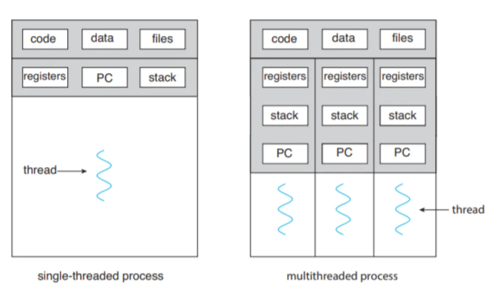

# week 2

## context switch 란?

1주차 문서에서 설명했던 것 처럼 thread 는 본질적으로 process 와 같고 OS 가 스케줄링하는 단위는 process 아니라 thread 다. 그래서 thread 도 process 와 동일하게 각자의 program counter 와 register 값들을 갖고 있고, 여러 스레드가 하나의 core 에서 실행되어야 할 경우 현재 실행중인 스레드에 해당하는 값들로 교체가 필요한데 이 과정을 context switch 라 부른다.



### context switch 의 비용이란게 정확히 뭔가?

- 하나의 cpu 코어는 하나의 thread 가 수행하는 동작을 다 끝내고 다른 thread 의 동작을 수행하는 식으로 정직하게 동작하지 않는다.
- 한 thread 의 동작을 하던 중간에 갑자기 끊고 다른 thread 의 동작을 하는 식으로 동시성을 구현했다.
- 그래서 어떤 thread 가 동작을 어디 까지했는지 기억해야하는데 이걸 thread context 라 부르고, 이 값중 cpu 가 당장 동작함에 필요한 값들을 cpu 내에 올렸다 나중에 다시 메모리로 내리는 과정이 필요한데 이걸 context switch 라 부른다.
    
    
    
- context switch 비용의 구성 요소들
    - 현재 실행 상태를 올리고 내리는 비용
        - 여러가지 register
        - Program Counter - 다음에 실행할 명령어의 주소
        - 커널 스택 포인터 - 커널 스택의 위치
    - 페이지 테이블 변경 (thread 간의 context 전환에서는 대부분 발생하지 않겠지만)
    - 캐시 초기화
        - thread 간의 전환이라면 일부러 cpu 캐시를 flush 하지는 않을 수 있으나
        - 캐시 미스는 확실히 많이 발생할 것 → 사실상 flush 된 꼴
    - 파이프라인 flush
        - 파이프라인은 확실히 flush 될 것

## java.util.concurrent 가족들

java.util.concurrent 패키지에는 동시성과 관련한 정말 유용한 도구들이 많은데 이 중 가장 많이 쓰이는 몇가지만 살펴보자.

### ExecutorService

- 스레드 풀을 통해 작업을 비동기적으로 실행할 수 있게 해주는 인터페이스
- 직접 스레드를 생성하고 관리하는 복잡성을 줄여준다!
- 앞서 말했듯 인터페이스이기 때문에 여러가지 구현체가 있다.
    - **ThreadPoolExecutor:** 스레드 풀을 구성할 수 있는 기본 구현체
    - **ScheduledThreadPoolExecutor:** 스케줄링 기능을 제공
    - **ForkJoinPool:** 대용량 작업을 작은 단위로 분할하여 병렬 처리에 하라고 만든 구현체
- 기본적인 사용 예시
    
    ```java
    ExecutorService executor = Executors.newFixedThreadPool(5);
    
    Future<Integer> future = executor.submit(new Callable<Integer>() {
        public Integer call() {
            // 뭔가 계산
            return 작업결과;
        }
    });
    
    try {
        Integer result = future.get(); // 작업 완료까지 대기
        System.out.println("결과: " + result);
    } catch (InterruptedException | ExecutionException e) {
        e.printStackTrace();
    } finally {
        executor.shutdown(); 
    }
    ```
    

### Future & CompletableFuture

- 비동기 작업의 결과를 나타내는 인터페이스인 Future
- Future 를 확장하여 비동기 작업의 완료 후 동작(콜백)을 정의하거나 여러 비동기 작업을 연결할 수 있게 만든 CompletableFuture
    - Future 의 get() 메소드는 작업이 완료될 때 까지 기다려야하고 별도의 콜백 메커니즘이 없다.
- CompletableFuture 의 사용 예시 몇가지

```java
CompletableFuture<String> future1 = CompletableFuture.supplyAsync(() -> "작업 1 결과");
CompletableFuture<String> future2 = CompletableFuture.supplyAsync(() -> "작업 2 결과");

CompletableFuture<String> combinedFuture = future1.thenCombine(future2, (result1, result2) -> {
    return result1 + " & " + result2;
});

combinedFuture.thenAccept(result -> System.out.println("조합된 결과: " + result));
// 조합된 결과: 작업 1 결과 & 작업 2 결과
```

- ExecutorService 를 명시적으로 지정하는 것도 가능하다!
- 기본적으로 CompletableFuture는 ForkJoinPool 의 공용 스레드 풀을 사용


- 하지만 아래처럼 별도 ExecutorService 를 주입 가능

```java
ExecutorService executor = Executors.newFixedThreadPool(3);

CompletableFuture.supplyAsync(() -> {
    // 비동기 작업
    return "결과";
}, executor).thenAccept(result -> System.out.println("결과: " + result));

executor.shutdown();
```

### ConcurrentHashMap

- 스레드 안전한 해시 맵 구현체
- 스레드 안전하다는 말은 곧
    - 여러 스레드가 동시에 맵에 접근하여 데이터를 읽고 쓰는 상황에서도 데이터 무결성을 유지할 수 있다는 말
- 스레드 안전하게 구현되었다면 성능 저하가 있지 않나?!
    - (문서에 따르면) 동기화로 인한 성능 저하를 최소화했다고 한다.
- ConcurrentHashMap 은 스레드 안전을 어떻게 구현했길래 성능 저하를 최소화했다는걸까?
    - 버킷 수준에서 락을 건다 → 성능 향상
        - 필요한 버킷에만 락을 걸고, 다른 버킷은 독립적으로 내버려 둔다.
    - 락도 사실 정말 필요할 때만 걸고 웬만하면 CAS 연산으로 락 없이 진행한다.
- 동작 방식
    - 키의 해시 값을 계산하여 버킷 인덱스를 결정
    - 버킷이 비어있으면 - CAS 연산을 사용하여 새로운 노드로 변경
    - 버킷이 안비어있으면
        - 락을 획득하고 연결 리스트 또는 트리를 탐색하여 키가 이미 존재하는지 확인
        - 키가 존재하면 값을 업데이트
        - 키가 없으면 새로운 노드를 연결
- ConcurrentHashMap 에서 값을 집어넣는 메소드를 아주 간략히 요약하면 아래와 같다.

```java
public V put(K key, V value) {
    return putVal(key, value, false);
}

final V putVal(K key, V value, boolean onlyIfAbsent) {
    Node<K,V>[] tab = table;
    Node<K,V> f = tabAt(tab, i); // volatile 읽기

    if (f == null) {
        // 비어있는 버킷에 새 노드 생성
        if (casTabAt(tab, i, null, 
            new Node<K,V>(hash, key, value, null)))
            break;
    } else {
        // 기존 노드가 있는 경우
        synchronized (f) {
            // 해당 노드만 잠금
            if (tabAt(tab, i) == f) {
                // 노드 갱신 작업
            }
        }
    }
}
```