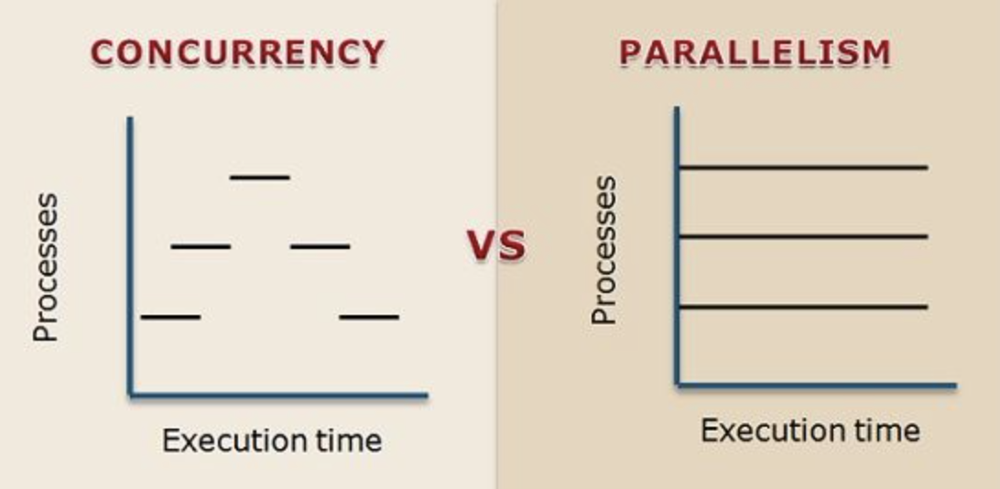
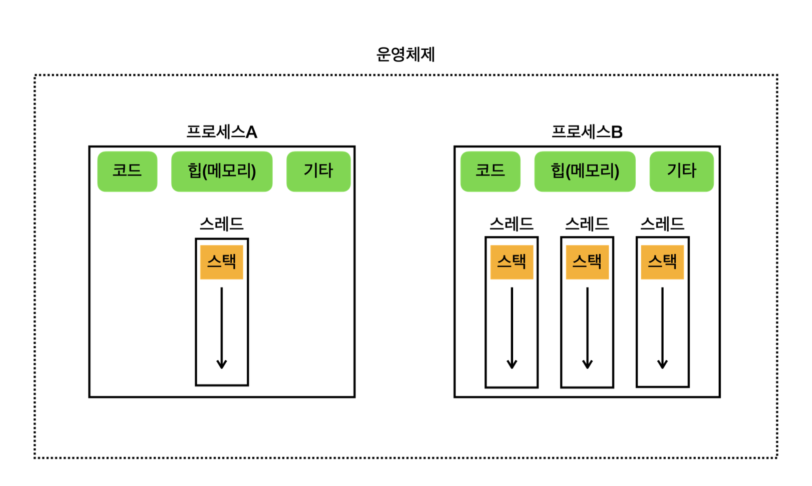
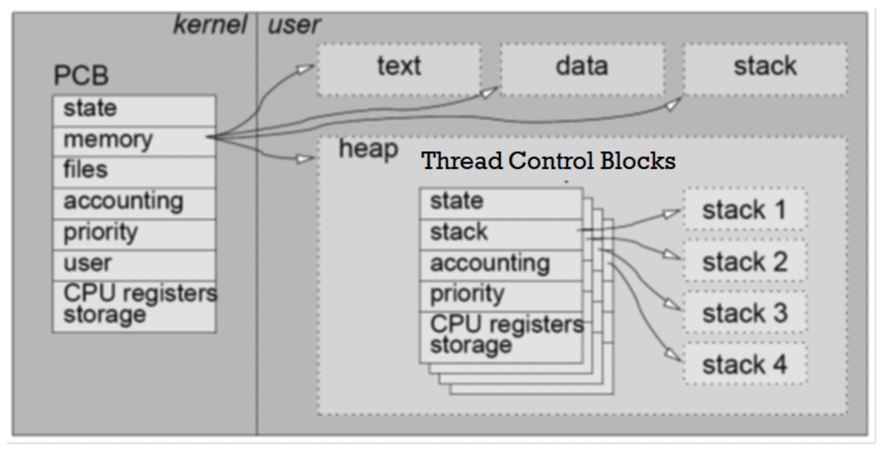
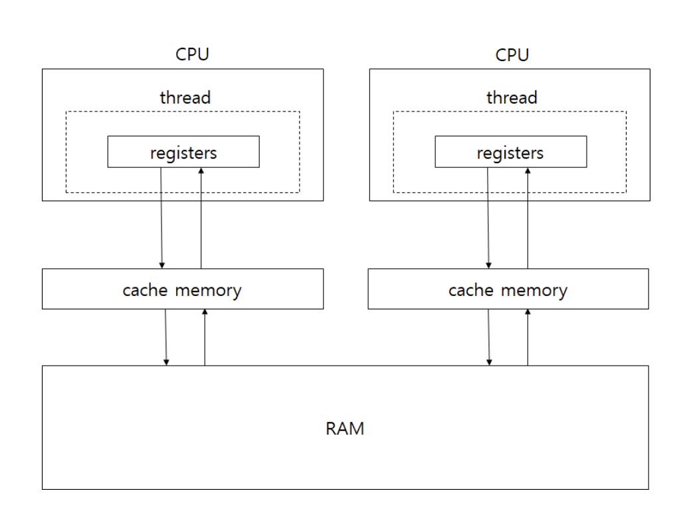
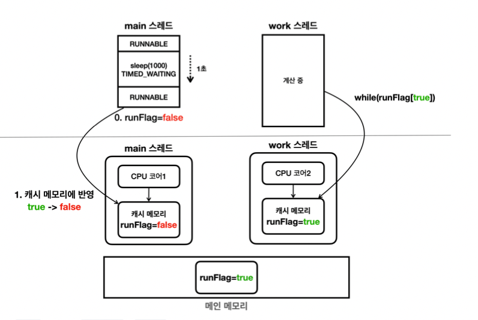
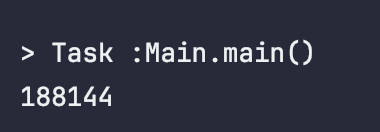
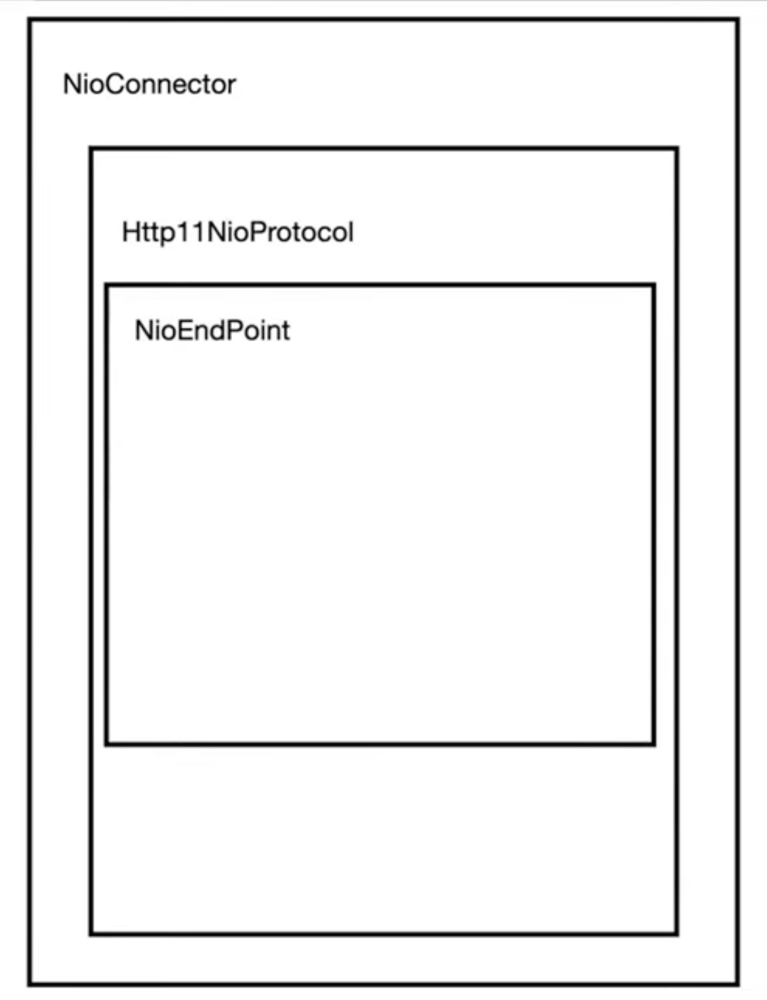
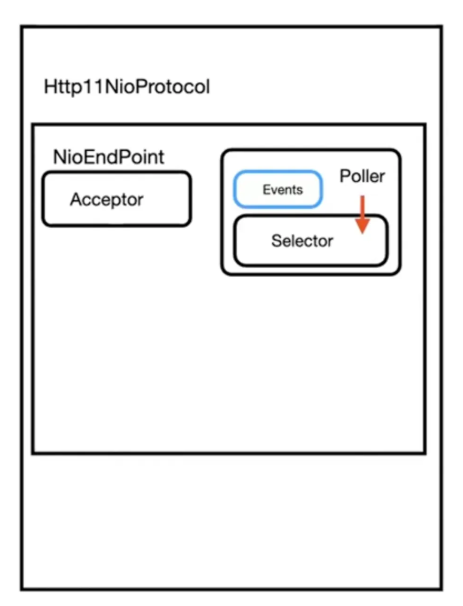
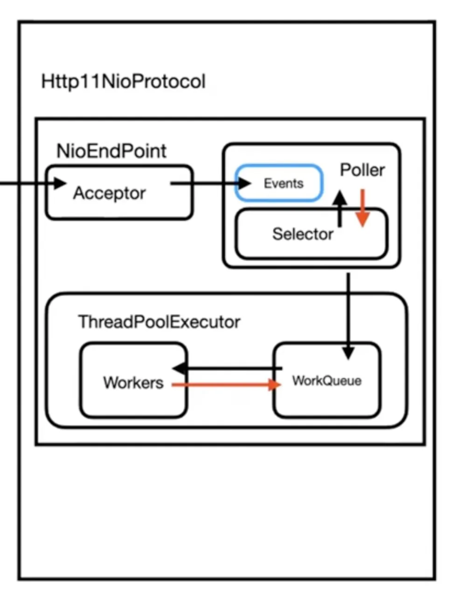
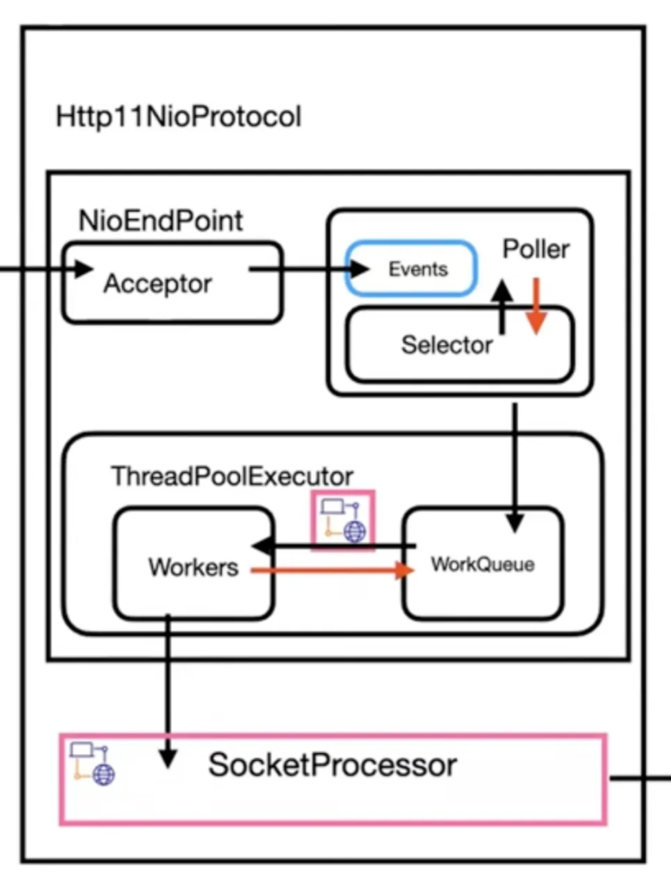

노션링크(https://www.notion.so/2-13a06b318c838022925efd39b8ddee0a?pvs=4)

# 2주차

# 컨텍스트 스위치 비용

## 컨텍스트 스위칭이란?

> CPU 코어에서 실행 중이던 프로세스(또는 스레드)가 다른 프로세스(또는 스레드)로 교체되는 것

## 컨텍스트 스위칭은 왜 일어나는가?

CPU 코어는 한 시점에 한 가지의 연산만 수행할 수 있음

→ 한 프로세스가 점유하게 되면, 해당 프로세스가 점유되는동안 다른 프로세스는 계속 대기해야함

이런 문제를 해결하기 위해 CPU 코어에서 실행되는 프로세스를 계속 변경하면서
여러 프로세스가 동시에 실행되는 것처럼(병행) 작업을 수행함.

### 병행 vs 병렬

- 병행(concurrency): 실행하는 프로세스를 계속 변경하면서 여러 프로세스를 한 번에 실행함(논리적으로)
- 병렬(parallelism): 실제로 여러 프로세스를 동시에 실행함(물리적으로)

> 멀티코어CPU 에서는 각 CPU 코어끼리는 병렬로 처리되며, 하나의 코어에 할당된 작업들끼리는 병행처리됨




## 컨텍스트 스위칭은 어떻게 일어나는가?

컨텍스트 스위칭은 프로세스 간에, 스레드 간에 일어날 수 있음

### 프로세스 간의 컨텍스트 스위칭

프로세스A → 프로세스B로 컨텍스트 스위치를 하는 과정

1. 스케쥴러가 프로세스A 실행을 중단하고 프로세스B를 실행하라고 시킴
2. 프로세스A를 실행하던 CPU의 상태 값들과 프로세스 정보를 **PCB**에 저장
3. 프로세스B의 PCB의 데이터를 CPU 레지스터에 로드하고 프로세스B 실행
    1. 다시 프로세스A를 실행할 때는 프로세스A의 PCB 값을 CPU 레지스터에 로드한 후 실행

### PCB(Process Control Block)

> 프로세스의 실행 상태를 스냅샷처럼 저장해두고, 다음에 해당 프로세스를 다시 실행해야할 때 이전 상태에서 그대로 실행을 시작할 수 있게 해줌
>

PCB에 저장되는 데이터는 다음과 같음

- pid
- cpu 레지스터 값
    - SP(Stack Pointer)
        - 프로세스 스택의 최상단을 가리키는 값
            - 스택: 메서드 호출 정보 / 로컬 변수 등 이 저장됨
    - PC(Program Counter)
        - 다음 실행할 명령어 위치를 가리키는 값
    - 등
- 프로세스 상태 (new, ready, running, waiting, dead )
- 스케줄링 상태 ( ready, suspended 등 )
- 우선순위

등

### 스레드 간의 컨텍스트 스위칭

프로세스 간 컨텍스트 스위칭과 동일하게

실행중인 CPU의 값들과 스레드의 상태를 저장해두고, 다음에 다시 실행할 때 불러와서 실행

단, PCB가 아닌 TCB(Thread Control Block)에 정보를 저장하게 됨.

동일한 프로세스 내의 스레드들은 코드, 데이터, 힙을 공유하지만 각자 고유한 스택을 가짐



스레드끼리는 코드 영역, 데이터 영역, 힙 영역을 공유하므로

**같은 프로세스 내에서 스레드 간 컨텍스트 스위칭을 하는 경우에는 공유하는 부분에 대한 값은 갱신할 필요가 없어짐.** (프로세스 간 컨텍스트 스위칭보다는 오버헤드가 적음)

**TCB (Thread Control Block)**

- tid
- 스택 포인터
- pc
- 스레드 상태 ( running, ready, waiting, start, done)
- 스레드 레지스터 값
- pcb 포인터
    - 해당 스레드가 속하는 프로세스를 가리키는 포인터



## 컨텍스트 스위칭 비용이란?

컨텍스트 스위칭 하는 과정에서 발생하는 시간 및 리소스 소모를 말함

---

# 자바 Keyword

## 자바의 메모리 구조

- CPU 코어가 작업을 처리하기 위해서 RAM에서 데이터를 읽어들인 후 CPU 코어의 캐시 메모리에 데이터를 복제함
    - CPU 코어는 각자의 CPU 캐시 메모리를 가짐
- 작업을 처리한 뒤에 변경된 CPU 코어의 캐시 메모리의 데이터를 RAM에 덮어 씌움



이런 메모리 구조로 인해 다음 두 가지 문제가 발생할 수 있음

1. 가시성 문제
2. 동시 접근 문제

## 가시성 문제

```java
public class Main {

    private static boolean running = true;

    public static void main(String[] args) throws InterruptedException {

        Thread thread = new Thread(() -> {
            System.out.println("스레드 시작");
            while (running) {
                // running이 true인 동안 계속 실행
            }
            System.out.println("스레드 종료");
        });

        thread.start();  // 스레드 시작

        Thread.sleep(1000);
        System.out.println("스레드 종료를 위해 running 값 변경");
        running = false;  // running 값을 false로 변경
    }

}
```

그냥 봤을 때는 “스레드 시작”이 출력된 후, “스레드 종료를 위해 running 값 변경”이 출력되고,

running 값이 false로 설정 되면서 Thread 내의 반복문이 종료 되며, “스레드 종료”가 출력되어야 할 거 같음.

하지만 실행해보면 “스레드 종료”가 찍히지 않고, 프로그램이 종료되지 않음.


왜그럴까?



**처음 실행 될 때**

- 메인 스레드는 running 변수 값을 메인 메모리에서 읽어서 **CPU 코어의 캐시**에 저장.
- Thread도 running 값을 **CPU 코어의 캐시**에 저장.

**메인 스레드에서 running 값을 false로 변경했을 떄**

- 메인 스레드의 CPU 캐시 메모리에만 반영되고, Thread의 캐시 메모리에는 반영이 안 됨

**Thread가 running 값에 접근했을 때**

- 자신의 CPU 캐시 메모리에 있는 running 값(true)를 계속 참조하고 있으므로 반복문이 종료되지 않음

### 해결 방법 - volatile

volatile 키워드를 사용하면, 해당 변수에 대해서는 값을 읽을 때나 쓸 때나 항상 메인 메모리에 직접 접근함.

값을 읽을 때 → 메인 메모리에서 값을 읽음

값을 쓸 때 → 메인 메모리에 값을 저장함

```java
public class Main {

    private static volatile boolean running = true;

    public static void main(String[] args) throws InterruptedException {

        Thread thread = new Thread(() -> {
            System.out.println("스레드 시작");
            while (running) {
                // running이 true인 동안 계속 실행
            }
            System.out.println("스레드 종료");
        });

        thread.start();  // 스레드 시작

        Thread.sleep(1000);
        System.out.println("스레드 종료를 위해 running 값 변경");
        running = false;  // running 값을 false로 변경
    }

}
```

위와 같이 volatile 키워드를 적용하면

메인 스레드에서 running = false;를 했을 때 해당 값이 메인 메모리에 반영되고,

생성한 스레드 내에서 running 값을 읽을 때 메인 메모리에서 읽어오기 때문에

프로그램은 잘 종료됨

## 동시 접근 문제

한 프로세스의 스레드들은 특정 자원을 공유하고 있음 (ex 코드 영역, 힙 영역 )

> 이런 **공유 중인 자원에 대해서 스레드가 동시에 접근하면서 발생하는 문제**를 동시성 문제라고 함
>


```java
public class Main {

    // 힙 메모리에 저장되는 전역 변수
    private static int number = 0;

    public static void main(String[] args) throws InterruptedException, ExecutionException {

        // 세 개의 스레드가 각자 number 자원에 접근해서 +1 을 십 만번씩 반복하는 작업을 실행
        Thread t1 = new Thread(() -> {
            for (int i = 0; i < 100000; i++) {
                number++;
            }
        });

        Thread t2 = new Thread(() -> {
            for (int i = 0; i < 100000; i++) {
                number++;
            }
        });

        Thread t3 = new Thread(() -> {
            for (int i = 0; i < 100000; i++) {
                number++;
            }
        });

        t1.start();
        t2.start();
        t3.start();
        t1.join();
        t2.join();
        t3.join();
        System.out.println(number);
    }

}
```

정상적으로 동작했다면 결과는 30만이어야하지만 다음과 같이 나옴



왜그럴까?

number++; 는 다음 세 가지 단계로 이루어져 있음

1. **읽기**

   메모리(CPU 캐시 메모리) 에서 number 값 읽기

2. **증가시키기**

   number 값 += 1

3. **쓰기**

   증가된 값 number에 저장

```agsl
[스레드A] number 값 읽기 : 0

— context switching —

[스레드B] number 값 읽기 : 0

[스레드B] number 값 증가 : 1

[스레드B] number 값 쓰기 : 1

— context switching —

[스레드A] number 값 증가 : 1

[스레드A] number 값 쓰기 : 1
```

위와 같이 컨텍스트 스위칭이 일어난다면??

스레드B와 스레드A가 각각 쓰기를 했는데 결국 저장되어 있는 값은 1임

연산 속도가 빠른 스레드의 변경 값이, 연산 속도가 느린 스레드에서의 변경 값으로 덮어 씌워짐

결국 number++ 연산 처리가 세 단계로 이루어지기 때문에, 연산 처리 중간에 컨텍스트 스위칭이 일어났을 때 문제가 발생함

→ **세 단계의 연산 처리를 하나로 묶어버리면 해결됨!**

### 해결 방법 - Synchronized

> 동일한 자원에 대한 동시 접근을 막는 방법
>

syncrhonized 키워드를 활용하면, 해당 자원에 접근하는 스레드를 최대 “한 개”로 제한함

== 여러 스레드가 접근하려고 할 때, 가장 처음 접근한 스레드가 작업을 끝낼 때까지 다른 스레드는 접근을 못 함

```java
// 1. synchronized method
// doSomething 메서드는 하나의 스레드에서만 실행할 수 있음
public synchronized void doSomething(){}

// 2. synchronized block
synchronized(object){}
```

위 문제를 synchronized로 해결한 코드

```java
import java.util.concurrent.ExecutionException;

public class Main {

    private static int number = 0;

    // 연산을 하는동안 다른 스레드는 메서드에 접근 불가
    // 세 단계인 연산 동작을 하는동안 다른 스레드는 끼어들 수가 없음
    public static synchronized void increaseNumber() {
        number++;
    }

    public static void main(String[] args) throws InterruptedException, ExecutionException {

        Thread t1 = new Thread(() -> {
            for (int i = 0; i < 100000; i++) {
                increaseNumber();
            }
        });

        Thread t2 = new Thread(() -> {
            for (int i = 0; i < 100000; i++) {
                increaseNumber();
            }
        });

        Thread t3 = new Thread(() -> {
            for (int i = 0; i < 100000; i++) {
                increaseNumber();
            }
        });

        t1.start();
        t2.start();
        t3.start();
        t1.join();
        t2.join();
        t3.join();
        System.out.println(number);
        // 300000이 출력됨
    }

}
```

👎다른 스레드의 접근 자체를 막는 것이기 때문에 성능이 저하될 수 있음

- +) 가시성 문제 해결에도 활용 가능

  synchronized가 적용된 블록/함수는 데이터를 **메인 메모리에서 가져옴**,

  synchronized가 적용된 블록/함수는 **해당 블록이 끝날 때** 캐시 뿐만 아니라 **메인 메모리에도 변경된 값을 즉시 저장**함

  ⇒ 자연스럽게 가시성 문제도 해결할 수 있음

  → 읽을 때의 값은 메인 메모리의 값(가시성 해결)임이 보장되고

  → 해당 값을 변경할 때는 다른 스레드의 접근을 막고(동시성 해결) 변경한 값을 메인 메모리에 저장(가시성 해결)하기 때문에

  잘 활용하면 동시성과 가시성 모두 해결할 수 있음

    - 가시성 문제를 synchronized 키워드로 해결한 예시

        ```java
        public class Main {
        
            private static boolean running = true;
        
            // running 값을 읽고 변경할 때 synchronized 사용
            public static synchronized boolean isRunning() {
                // 메인 메모리의 값 읽음
                return running;
            }
            public static synchronized void setRunning(boolean value) {
                running = value;
                // 메인 메모리에 값 씀
            }
        
            public static void main(String[] args) throws InterruptedException {
        
                Thread thread = new Thread(() -> {
                    System.out.println("스레드 시작");
                    while (isRunning()) {  // synchronized로 보호된 메서드로 값을 읽음
                        // running이 true인 동안 계속 실행
                    }
                    System.out.println("스레드 종료");
                });
        
                thread.start();  // 스레드 시작
        
                Thread.sleep(1000);
                System.out.println("스레드 종료를 위해 running 값 변경");
                setRunning(false);  // synchronized로 보호된 메서드로 값을 변경
            }
        }
        ```

### 해결 방법 - Atomic 변수

> 원자성을 보장하는 객체의 변수를 활용하는 방법
>

원리:  CAS 알고리즘 ( Compare And Swap )

**캐시 메모리** & **메인 메모리에** 저장된 값을 비교하여 일치하는 경우는 새로운 값으로 교체하는 방식

```java
public class AtomicInteger extends Number implements java.io.Serializable {

    private volatile int value;

    public final int incrementAndGet() {
        int current;
        int next;
        do {
            // 메인 메모리에 저장되어 있는 "현재 값(current)" 가져오기
            current = get();
            // 연산 수행
            next = current + 1;
        } while (!compareAndSet(current, next));
        // 메인 메모리에 있는 값이 처음 읽어온 "현재 값(current)"과 일치할 때만 바로 값 반환
        // 일치하지 않는다면 일치할 때까지 반복문 돌기

        return next;
    }

    // 연산을 수행하는동안 메인 메모리의 값이 바뀌었는지 검사하는 함수
    public final boolean compareAndSet(int expect, int update) {
        return unsafe.compareAndSwapInt(this, valueOffset, expect, update);
    }
}

```

---

# Spring Tomcat의 스레드

Spring Boot에 요청이 들어왔을 때 스레드 할당하고, 스레드 풀을 관리하는 작업은 **내장 톰캣**에서 일어남

아래 설명은 내장 톰캣 버전 10.1.X에 대한 설명

### 요청이 Controller까지 도달하게 되는 과정



서버가 실행되면 NioConnecter가 생성되고,

NioConnector 안에는 Http11NioProtocol이 생성되고,

Http11NioProtocol 안에는 NioEndPoint가 생성됨

### NioEndPoint 내 동작

주요 객체: Accepetor, Poller, Events, ThreadPoolExecutor



1. **Acceptor**

   요청을 처음 받는 곳

   소켓 채널을 기다렸다가 받아들인 후 Poller 내의 Events 큐에게 넘겨주는 객체

2. **Poller**
    - Events

      Poller가 관리하고 있는 채널들의 큐를 의미함

    폴러는 채널들을 갖고 있다가 “준비된” 채널이 생기면 스레드 풀에게 해당 채널을 전달함
    
    **준비된 채널?**
    
    채널 연결만 된 것이 아니라, 연결된 소켓으로 **데이터 수신까지 완료된 채널**을 말함
    
    **어떤 채널이 준비됐는지는 어떻게 아나요?**

3. **Selector**

   Poller의 events를 모니터링하면서 준비된 채널이 있는지 검사

    ```java
    while (true) { selector.selectNow(); }
    ```

   Poller는 위 Selector에게서 준비된 채널을 받고, ThreadPoolExecutor에게 전달하게 됨.

4. **ThreadPoolExecutor**



Poller에게 받은 준비된 채널들은 **`workQueue`**에 저장됨

**`Workers`**에는 대기 중인 스레드들이 있는데

```java
while(workQueue.getTask())
```

위 블락킹 콜로 **`workQueue`**에서 작업을 할당받고, 작업을 처리하기 위해 Servlet으로 가는 것.

여기서 말하는 Worker들이 서버에 요청이 들어왔을 때 로그에 찍히는 “http-nio~~~” 스레드들임


**Worker들은 Servlet에 어떻게 도착하나?**



Worker들은 Acceptor에서부터 Poller를 거쳐온 소켓 채널을 랩핑한 “SocketProcessor” 객체를 들고 있게 되는데,

SocketProcessor는 Adapter, Mapper라는 객체를 알고 있고, 이 객체들을 활용해서 알맞은 Servlet을 찾음