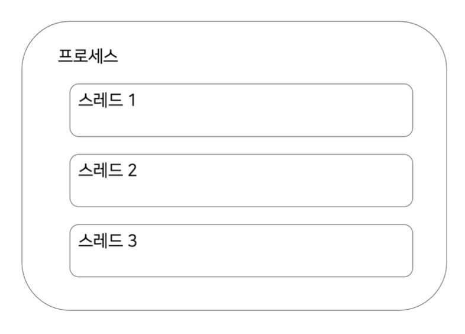
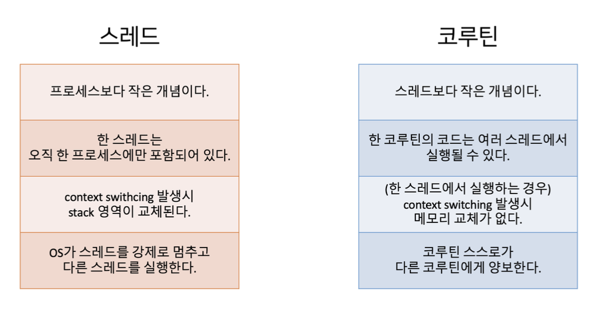
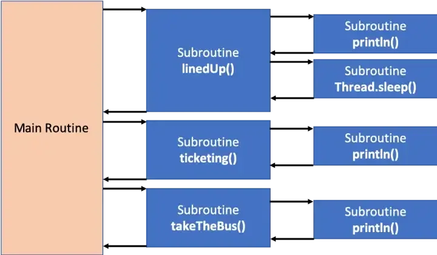
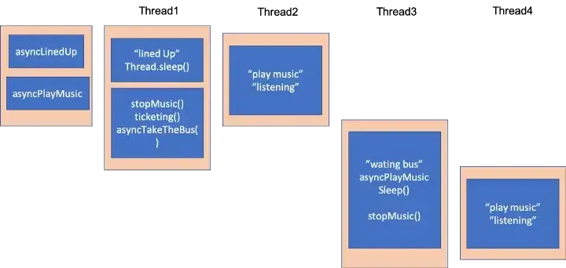
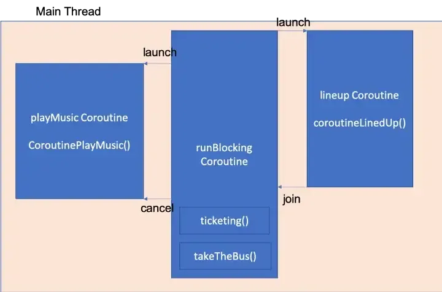

## 코루틴의 동작 원리, 스레드와의 차이

### 스레드와의 차이

아시다시피 스레드는 프로세스보다 작은 개념으로, 프로세스 내에 있는 여러 코드들의 작은 실행단위입니다.

위처럼 보통 멀티 스레드 환경에서 한 프로세스 내에 여러 스레드를 가지고 있습니다.

여기서 간단히 정리해보면, 스레드는 프로세스가 있어야 하고, 스레드는 코드를 실행하며 스레드가 프로세스보다 작은 개념입니다.
코루틴은 단지 우리가 작성한 루틴으로, 코드의 종류 중 하나이기 때문에 코루틴 코드가 실행되려면 스레드가 있어야만 합니다. 그런데 코루틴은 중단되었다가 재개될 수 있기 때문에, 코루틴 코드의 앞부분은 1번 스레드에 배정되고, 뒷부분은 2번 스레드에 배정될 수 있습니다.

여기서 코루틴은 스레드보다 작은 개념(경량 스레드)이기에 **프로세스 > 스레드 > 코루틴** 으로 크기가 비교됩니다.

---

프로세스 내에 스레드는 독립적으로 가져가기에 특정 스레드가 다른 특정 프로세스에 옮겨갈 수는 없습니다.
코루틴 같은 경우는 코루틴이 직접 코드를 실행시키는 개념이 아니라 코루틴이 가지고 있는 코드를 스레드에 넘겨 실행하는 방식입니다.

일단 코루틴이라는 존재는 중단과 재개가 가능한 루틴이며, 우선 특정 코루틴 내에 코드1,2가 존재한다고 가정해보겠습니다.

두 개의 스레드1, 2가 존재하면 코루틴 내에 코드1이 시작되고 스레드1에서 실행됩니다.
이후 코루틴 내에 코드1이 끝나고 중단되는 지점이 있다면, 코드2가 스레드2에서 실행할 수 있도록 스레드 할당이 가능합니다.

---

그리고 코루틴과 스레드는 **Context Switching(문맥 교환)** 에서도 차이가 발생됩니다.

우선 프로세스의 Context Switching이 일어난다면 각각의 프로세스는 완전히 독립된 메모리를 가지고 있기 때문에, CPU 코어에서 특정 프로세스를 가져가 실행시킬 때 프로세스1의 메모리를 사용합니다. 여기서 Context Switching이 발생된다면 두 번째 프로세스 메모리로 완전히 갈아끼워야 합니다.

그래서 메모리 비용이 크게 발생되는데, 스레드는 좀 다릅니다.
일단 스레드는 프로세스내에 독립적으로 움직이는 걸 알아봤었죠? 스레드는 스택 영역을 가지고 있다. 힙 내에서 스택 공유가 자유롭습니다. os로 인해 스레드1이 중단되고 스레드2로 갈아끼울 때 힙 영역은 그대로 두고 스택만 갈아끼우면 되는 것입니다.
즉, 스레드는 힙 메모리 영역을 공유하고, 스택만 교체되기에 Context Switching 비용이 적게 든다는 것을 알아봤었습니다.

코루틴은 아까 작성했던 내용처럼 중단되었다가 재개되는 게 포인트입니다.
멈췄다가 다른 코루틴이 실행되고 한 스레드에서 여러 코루틴이 실행됩니다.
한 스레드에서 코루틴1이 코드1,2를 가지고, 코루틴2가 코드3을 가지고 있다 가정해보겠습니다.
코루틴1의 코드1이 스레드에서 실행되었다가 중단 지점이후 코루틴2의 코드3을 실행하도록 양보(yield)하고, 코루틴 코드2를 스레드에 실행되도록 할 수 있습니다.
여기서 스레드 교환이 아닌 코루틴의 중단과 재개를 활용하여 메모리 전체를 공유하기에 Context Switching 비용이 스레드보다 적게 듭니다.

- 이렇게 양보하는 행위를 온보딩했었던 비선점형이라고도 합니다.
- 스레드처럼 어떤 다른 존재에 의해 직접적으로 개입되서 자리가 비켜지는 걸 선점형이라 합니다.

여기서 코루틴의 장점이 보일 수 있는 점으로 **동시성 확보**가 가능합니다.

---

### 코루틴 동작 원리

우선 스레드와의 차이부터 알아보겠습니다.
스레드와의 차이를 이해하고 동작 과정에 대해 이야기 할 것인데, 예시 코드와 함께 보시는 것이 이해하는 데에 도움이 될 듯하여 스레드와의 차이부터 정의를 해보았습니다.

우선 [기본적인 티켓팅 예제 코드](./week3/src/main/kotlin/com/sipe/week3/TicketingExample.kt) 를 통해서 설명을 드리겠습니다.

위 코드에서 프로그램의 시작점인 main 함수가 메인 루틴이 되고 그 안에 호출되는 각각의 함수는 서브 루틴이라고 볼 수 있습니다. 서브루틴은 진입점과 종료시점을 갖게 되는데 일반적으로 사용하는 함수의 호출 시점과 return 시점이 진입과 종료 시점이 됩니다. 서브루틴은 진입점부터 종료시점까지 중단없이 실행이 되기 때문에 각각의 서브루틴들 사이의 관계는 계층적, 직렬적 관계가 됩니다.

생각보다 코루틴이나 비동기 프로그래밍을 안했을 때 실행되는 서브 루틴이 많습니다.
만약 비즈니스 로직 내부 루틴들이 실행될 경우 많은 스레드와 로직이 왔다갔다 하는 것을 볼 수 있어요.

---

그렇다면 이번엔 비동기적으로 로직을 변경하여 [변경된 코드](./week3/src/main/kotlin/com/sipe/week3/ThreadExample.kt)를 리뷰해보겠습니다.

순서는 티켓팅 기다리면서 -> 음악을 듣는데 -> 내 차례가 되면 음악을 멈추고 티켓팅 한다. -> 버스를 기다린다. -> 버스가 도착한다. -> 음악을 멈추고 버스를 탄다.

비동기 처리를 해주면서 코드가 조금 더 복잡해졌습니다. 이런 단순히 thread와 callback을 이용한 비동기 처리는 몇 가지 문제점을 가지고 있답니다.

첫번짼는 코드의 복잡성인데요, 각각의 루틴들은 독립적인 스레드 안에서 동작을 합니다. 따라서 각 루틴들이 서로에게 영향을 주기 위해서는 스레드 사이에 통신이 필요하게 됩니다.

이는 코드를 복잡하게 하고 관리하기 힘들게 합니다. 또한 thread/callback 구조는 코드 상으로 흐름을 파악하기가 쉽지 않습니다. (위 코드에서도 어떤 순서로 동작되는지 쉽게 파악하기가 어렵습니다.)

두번째는 비용입니다. 기본적으로 thread는 OS에서 할당하고 관리를 하게 됩니다. OS에서 스레드들의 작업을 적절하게 분배하기 위해 코어에 각각의 태스크들을 적절하게 할당 및 회수 작업을 하게 됩니다. 이처럼 OS에 의해서 작업이 할당되는 것을 preemptive multitasking이라고 합니다. OS가 각 thread의 작업을 스케줄링할 때 컨텍스트 스위칭이 필요하게 됩니다. 이때 스위칭 비용이 발생하게 됩니다. 무분별한 스레드 생성이 결국 많은 리소스를 소비하게 하여 전체적으로 프로그램의 성능을 저하시킬 수도 있습니다.

이런 thread/callback을 이용하여 비동기 프로그래밍을 하는 과정에서는 코드의 복잡도와 비용의 증가로 많은 문제를 야기할 수 있습니다. 그래서 이런 점들을 해결하기 위한 다양한 방법들이 나오기 시작합니다. 언어 자체에서 이런 문제들을 해결하기 위한 다양한 방법들이 등장하기도 하며 다양한 비동기 프로그래밍을 위한 라이브러리들도 등장하였습니다. 이런 언어적 지원과 라이브러리 지원들은 자체적으로 thread를 관리해주고 callback지옥에 빠지지 않고 단순하고 파악하기 쉬운 비동기 프로그래밍을 하도록 지원을 해줍니다.

코루틴 또한 이런 단점들을 해결해주는 언어적 기능 중 하나이며, 위에서 본 코루틴의 정의에서 non-preemptive multitasking(비선점)라는 것을 확인할 수 있는데요, 코루틴은 thread와 callback 을 통한 비동기 프로그래밍에서의 단점들을 non-preemptive multitasking 방식으로 해결하고 있습니다.

#### non-preemptive multitasking란?

코루틴은 os가 스레드들의 작업을 스케줄링 하도록 하지 않고, 서브루틴 간의 상호작용을 통해서 언어적으로 또는 코드 작성자가 직접 작업을 스케줄링 할 수 있도록 합니다.

---

이번엔 코틀린을 사용하기에 코루틴을 사용한 티켓팅 로직을 [변경해본 코드](./week3/src/main/kotlin/com/sipe/week3/CoRoutineExample2.kt)를 리뷰해보겠습니다.

runBlocking은 현재 스레드를 block하는 코루틴을 생성하는 함수입니다.
runBlocking의 이름은 이를 실행하는 스레드(이 경우 메인 스레드)가 runBlocking { ... } 내부의 모든 코루틴이 실행을 완료할 때까지 호출 기간 동안 차단된다는 것을 의미합니다. 스레드(일반 루틴 세계)는 비용이 많이 드는 리소스이고 이를 차단하는 것은 비효율적이며 종종 바람직하지 않기 때문입니다.

launch 함수는 현재 스레드에 대한 blocking 없이 실행되는 코루틴을 생성합니다. 즉 현재 스레드에 다른 작업을 할당할 수 있습니다.

위 코드에서는 크게 runBlocking, lineUp, playMusic 3개의 coroutine 이 상호작용을 하고 있습니다. runBlocking 은 메인 스레드를 잡고 있으며 작업이 완료될 때까지 프로그램이 종료되지 않도록 합니다. 즉 메인 루틴이 됩니다.

메인 루틴은 lineUp 과 playMusic 이라는 2개의 코루틴을 생성하고 실행합니다. lineUp과 playMusic 은 동시성을 보장하면서 각각의 서브 루틴을 수행합니다. 그 후 메인 루틴에서 lineUp.join() 이라는 함수를 호출합니다. 이는 lineUp 코루틴이 완료될 때까지 현재 루틴을 일시정지 시키고 lineUp 코루틴이 완료가 되면 그 때 루틴을 다시 재개하겠다라는 의미입니다. lineUp 코루틴이 완료가 되면 playMusic 코루틴을 cancel 시키고 ticketing과 takeTheBus를 호출하는 구조입니다. 이를 도식화 해보면 아래 그림과 같습니다.

위 그림처럼 코루틴을 이용하여 루틴과 루틴간의 관계 정의만을 통해서 동시성이 보장되는 비동기 프로그래밍을 하였습니다. 일반적인 서브루틴과는 다르게 코루틴에서는 비동기적으로 routine을 실행할 수 있었으며 각 루틴에서 실행되는 작업들을 중간에 일시정지(lineUp.join())하고 임의의 시점에 재개할 수 있습니다. 이를 통해 코드는 더 읽기 쉬워졌으며 개발자가 정의한 모든 서브루틴을 같은 context 내에서 (해당 프로그램에서는 main thread) 쉽게 실행할 수 있게 합니다. 이처럼 코루틴은 routine 과 routine 간의 관계를 정의하고 정의된 관계에 따라 스케줄링을 코드 레벨에서 해줌으로서 코드를 좀 더 명확하게 하고 컨텍스트 스위칭 비용을 줄일 수 있게 합니다.

#### GPT의 분석 (전체 동작 설명)

1. 코루틴 스코프 생성 및 코루틴 시작

- runBlocking 스코프 내에서 여러 launch 코루틴이 실행됩니다.
- lineUp 코루틴이 시작되며, coroutineLinedUp 함수가 호출되고 “lined up”을 출력한 후, 2초 동안 delay로 일시 중단됩니다.

2. 다른 코루틴 병렬 실행

- playMusicWithLinedUp 코루틴이 시작되어, coroutinePlayMusic 함수가 호출됩니다.
- “play music”을 출력한 후, 500ms마다 “listening..“을 출력하며 무한히 반복됩니다.
- lineUp.join()을 호출하여 coroutineLinedUp이 완료될 때까지 대기합니다.
- 이후 playMusicWithLinedUp.cancel()을 호출하여 coroutinePlayMusic의 무한 루프를 중단시킵니다.

3. 다음 단계의 작업

- coroutineTicketing() 함수가 호출되어 “ticketing”을 출력합니다.
- 이후, waitingBus와 playMusicWithWaitingBus 코루틴이 각각 시작됩니다.
- waitingBus는 coroutineWaitingTheBus를 실행하여 “waiting the bus”를 출력하고 2초간 대기합니다.
- playMusicWithWaitingBus는 coroutinePlayMusic을 실행하여 “play music”을 출력한 후, “listening..“을 무한히 출력합니다.
- waitingBus.join()을 통해 coroutineWaitingTheBus가 완료될 때까지 대기합니다.
- playMusicWithWaitingBus.cancel()을 호출하여 coroutinePlayMusic의 무한 루프를 중단합니다.

4. 마지막 작업

- coroutineTakeTheBus()가 호출되어 “take the bus”를 출력합니다.
- 모든 작업이 완료되면 runBlocking 스코프가 종료되고, 프로그램이 종료됩니다.

요약

- Kotlin의 코루틴은 launch와 runBlocking을 통해 비동기적으로 작업을 실행하고 관리할 수 있습니다.
- delay와 같은 일시 중단 함수는 스레드를 차단하지 않고, 코루틴을 일시 중단하여 효율적으로 시간을 대기합니다.
- cancel과 join을 사용하여 코루틴의 생명 주기를 제어할 수 있으며, 무한 루프 코루틴에서 delay를 사용하여 취소가 가능하도록 처리할 수 있습니다.

### 참고 링크

- https://tech.wonderwall.kr/articles/coroutinedeepdive/
