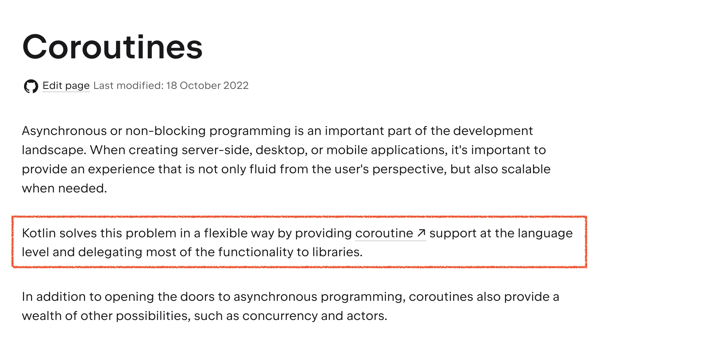
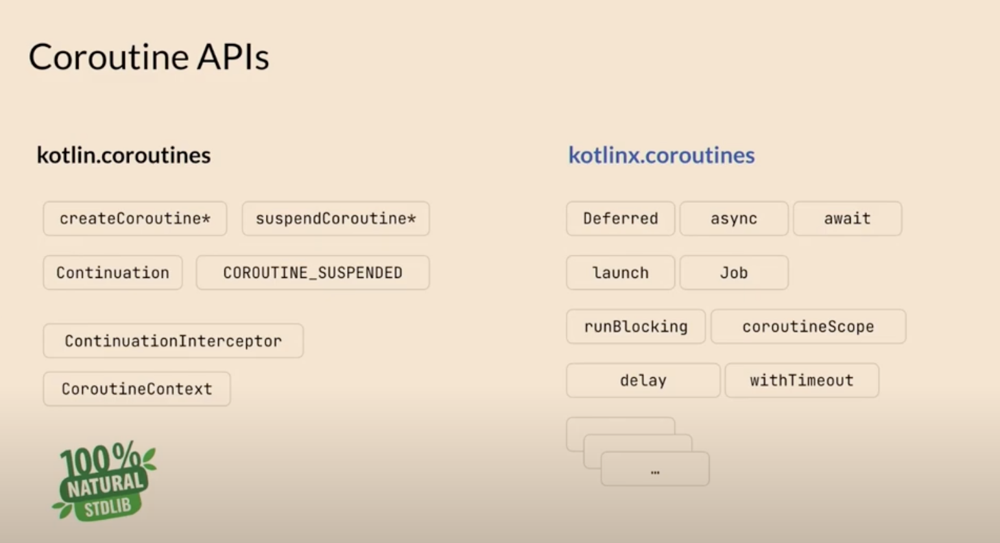

# week 3

## 코루틴이 뭔가?

- 코루틴이라는 개념 자체는 컴퓨터 공학 분야에서 꽤 오래전 부터 존재 (1958)
- 한줄로 요약하자면 “**중단 가능한 함수**” 정도가 되겠다.
- ‘경량 스레드’라고 표현할 수도 있지만 그건 코루틴의 구현에 대한 설명에 가깝고 실질적인 개념에선 살짝 멀어진 표현이라고 생각
- 코틀린도 ‘코루틴’이라는 개념을 JVM 상에서 언어 레벨로 구현했고, 이걸 본래 이름 그대로 coroutine 이라 부른다. (go 가 goroutine 이라고 부르는 것 처럼 따로 이름을 바꾸지는 않았다.)
    
    
    
- 코틀린의 코루틴 구현체는 kotlin.coroutines 패키지에 있다. kotlinx.corouines 와는 다르다!



## 이제 뭔지는 대충 알겠는데 왜 쓰나요?

- 코루틴의 효용성은 크게 보면 두개라고 생각
    1. 아주 편리하고 간결한 비동기 프로그래밍 (기존 비동기 프로그래밍을 위한 도구들이 너무 불편)
    2. 리소스 절약
- 코루틴이 어떻길래 편리한 비동기 프로그래밍이 가능하며 왜 리소스를 절약할 수 있는지 살펴보자.

### 간결한 비동기 프로그래밍

- 전통적인 비동기 프로그래밍은 주로 콜백(callback)이나 Future, Promise와 같은 패턴인데, 이게 생각보다 쓰기 번거롭다.
- 전통적인 방식의 나쁜 예시로 콜백 지옥이 있겠다.
    - 중첩된 콜백이 많아질수록 코드의 가독성이 떨어지고 유지보수가 어려워짐
        
        ```java
        // 1. 사용자 정보 조회
                userRepository.findUserById(userId, new Callback<User>() {
                    @Override
                    public void onSuccess(User user) {
                        // 2. 사용자의 장바구니 정보 조회
                        cartRepository.getCartItems(user.getCartId(), new Callback<List<CartItem>>() {
                            @Override
                            public void onSuccess(List<CartItem> cartItems) {
                                // 3. 재고 확인
                                inventoryService.checkInventory(cartItems, new Callback<Boolean>() {
                                    @Override
                                    public void onSuccess(Boolean inStock) {
                                        if (inStock) {
                                        ...
        ```
        
    - 코루틴을 으로 변환하면 아래처럼 그냥 동기적으로 돌아가는 코드 쓰듯이 작성 가능
        
        ```kotlin
                // 1. 사용자 정보 조회
                val user = userRepository.findUserById(userId)
                
                // 2. 장바구니 정보 조회
                val cartItems = cartRepository.getCartItems(user.cartId)
                
                // 3. 재고 확인
                val inStock = inventoryService.checkInventory(cartItems)
                if (!inStock) {
                    throw RuntimeException("재고가 충분하지 않습니다.")
                }
        ```
        
- 구조적 프로그래밍 (structured concurrency)
    - (전통적인 방식의) 비동기 코드는 기존 동기 코드와 비교했을 때 코드를 읽는데 드는 비용이 크다.
    - 옛날 옛적에 goto 가 왜 사라졌는가?
    - 위에서 아래로 흐르는 코드의 흐름을 바꿔버리고, 이로 인해 코드의 추상화가 깨지지 때문
    
    
    
    - 전통적인 방식은 위에서 아래로 흐르는 코드의 구조적인 특성를 지키지 못함
    - 코틀린의 코루틴은 coroutine 의 개념과 더불어 structured concurrency 를 도입
    - 코루틴 간에 부모와 자식 관계를 설정할 수 있음 (scope)
        
        
        
    - **동시성(concurrency) 코드를 구조적으로(structured) 작성**할 수 있게 됨

### 리소스 절약

- 앞서 설명했듯 코루틴은 ‘경량 스레드’ 라고도 불림
- 여러개의 코루틴이 하나의 스레드로 실행될 수 있기 때문
- 이는 코루틴의 핵심인 ‘중단 가능’ 하다는 특성을 이용
- 하나의 스레드를 재활용하기에 우리가 이전에 공부했던 그 비싼 context switch 가 덜 발생
- 어떻게 여러 코루틴이 하나의 스레드를 공유해서 사용할 수 있는가?
    - **컨티뉴에이션(Continuation)**
        - 코루틴의 실행 상태를 나타내는 객체
        - 함수가 일시 중단된 위치와 변수 상태를 저장
        - 함수가 중단될 때 스레드와 재개될 때의 스레드는 다르더라도 같은 컨티뉴에이션 객체를 참조
    - **컴파일러 변환**
        - 코틀린 컴파일러는 suspend 함수를 상태 머신(state machine)으로 변환하여 일시 중단과 재개를 관리
            
            ```kotlin
            suspend fun myFunction() {
                println("Start")
                delay(1000)
                println("Middle")
                delay(1000)
                println("End")
            }
            ```
            
        - 위 같은 suspend 함수는 컴파일 후 아래처럼 변환됨 (간략히 표현한거라 실제 구현과는 다름)
            
            ```kotlin
            fun myFunction(continuation: Continuation<Unit>): Any {
                var state = 0
            
                // 상태 머신
                when (state) {
                    0 -> {
                        println("Start")
                        state = 1
                        return delay(1000, continuation.withState(state))
                    }
                    1 -> {
                        println("Middle")
                        state = 2
                        return delay(1000, continuation.withState(state))
                    }
                    2 -> {
                        println("End")
                        return Unit // 함수 완료
                    }
                }
            }
            ```
            

## 코루틴 예시 코드

```kotlin
package org.example

import kotlinx.coroutines.*
import java.util.concurrent.CompletableFuture
import java.util.concurrent.ExecutorService
import java.util.concurrent.Executors

fun main() {

    val example = Example()

    val start = System.currentTimeMillis()
    runBlocking {
        example.coroutineExample()
    }
    val end = System.currentTimeMillis()
    println("coroutineExample time : ${end - start} ms")

    println("=====================================")

    val start2 = System.currentTimeMillis()
    example.threadBasedExample()
    val end2 = System.currentTimeMillis()
    println("threadBasedExample time : ${end2 - start2} ms")
}

class CoroutineProductService(
    private val productClient: ProductClient,
    private val reviewClient: ReviewClient,
    private val inventoryClient: InventoryClient
) {
    private val singleThreadDispatcher = Dispatchers.IO.limitedParallelism(1)

    suspend fun getProductDetails(productId: String): ProductDetails = coroutineScope {

        val product = async(singleThreadDispatcher) {
            println("상품 조회 시작 - 스레드: ${Thread.currentThread().name}")
            productClient.fetchProductSuspend(productId)
        }
        val reviews = async(singleThreadDispatcher) {
            println("리뷰 조회 시작 - 스레드: ${Thread.currentThread().name}")
            reviewClient.fetchReviewsSuspend(productId)
        }
        val inventory = async(singleThreadDispatcher) {
            println("재고 조회 시작 - 스레드: ${Thread.currentThread().name}")
            inventoryClient.fetchInventorySuspend(productId)
        }

        ProductDetails(
            product = product.await(),
            reviews = reviews.await(),
            inventory = inventory.await()
        ).also {
            println("코루틴 버전 완료 - 현재 스레드: ${Thread.currentThread().name}")
        }
    }
}

class ThreadBasedProductService(
    private val productClient: ProductClient,
    private val reviewClient: ReviewClient,
    private val inventoryClient: InventoryClient,
    private val executor: ExecutorService = Executors.newFixedThreadPool(3)
) {
    fun getProductDetails(productId: String): CompletableFuture<ProductDetails> {
        val productFuture = CompletableFuture.supplyAsync(
            {
                println("상품 조회 시작 - 스레드: ${Thread.currentThread().name}")
                productClient.fetchProduct(productId)
            },
            executor
        )

        val reviewsFuture = CompletableFuture.supplyAsync(
            {
                println("리뷰 조회 시작 - 스레드: ${Thread.currentThread().name}")
                reviewClient.fetchReviews(productId)
            },
            executor
        )

        val inventoryFuture = CompletableFuture.supplyAsync(
            {
                println("재고 조회 시작 - 스레드: ${Thread.currentThread().name}")
                inventoryClient.fetchInventory(productId)
            },
            executor
        )

        return CompletableFuture.allOf(
            productFuture,
            reviewsFuture,
            inventoryFuture
        ).thenApply {
            ProductDetails(
                product = productFuture.get(),
                reviews = reviewsFuture.get(),
                inventory = inventoryFuture.get()
            )
        }.also {
            println("스레드 기반 버전 완료 - 현재 스레드: ${Thread.currentThread().name}")
        }
    }

    fun close() {
        executor.shutdown()
    }
}

data class Product(val id: String, val name: String, val price: Double)
data class Review(val id: String, val rating: Int, val comment: String)
data class Inventory(val productId: String, val quantity: Int)
data class ProductDetails(
    val product: Product,
    val reviews: List<Review>,
    val inventory: Inventory
)

interface ProductClient {
    suspend fun fetchProductSuspend(productId: String): Product

    fun fetchProduct(productId: String): Product
}

interface ReviewClient {
    suspend fun fetchReviewsSuspend(productId: String): List<Review>
    fun fetchReviews(productId: String): List<Review>
}

interface InventoryClient {
    suspend fun fetchInventorySuspend(productId: String): Inventory
    fun fetchInventory(productId: String): Inventory
}

class Example {
    suspend fun coroutineExample() {
        val service = CoroutineProductService(
            productClient = MockProductClient(),
            reviewClient = MockReviewClient(),
            inventoryClient = MockInventoryClient()
        )

        val details = service.getProductDetails("prod-1")
        println("상품 상세 정보: $details")
    }

    fun threadBasedExample() {
        val service = ThreadBasedProductService(
            productClient = MockProductClient(),
            reviewClient = MockReviewClient(),
            inventoryClient = MockInventoryClient()
        )

        service.getProductDetails("prod-1")
            .thenAccept { details ->
                println("상품 상세 정보: $details")
            }
            .join()

        service.close()
    }
}

class MockProductClient : ProductClient {
    override suspend fun fetchProductSuspend(productId: String): Product {
        delay(1000) 
        return Product(productId, "테스트 상품", 10000.0)
    }

    override fun fetchProduct(productId: String): Product {
        Thread.sleep(1000) 
        return Product(productId, "테스트 상품", 10000.0)
    }
}

class MockReviewClient : ReviewClient {
    override suspend fun fetchReviewsSuspend(productId: String): List<Review> {
        delay(1000)
        return listOf(
            Review("review-1", 5, "아주 좋아요"),
            Review("review-2", 4, "괜찮습니다")
        )
    }

    override fun fetchReviews(productId: String): List<Review> {
        Thread.sleep(1000)
        return listOf(
            Review("review-1", 5, "아주 좋아요"),
            Review("review-2", 4, "괜찮습니다")
        )
    }
}

class MockInventoryClient : InventoryClient {
    override suspend fun fetchInventorySuspend(productId: String): Inventory {
        delay(1000)
        return Inventory(productId, 100)
    }

    override fun fetchInventory(productId: String): Inventory {
        Thread.sleep(1000)
        return Inventory(productId, 100)
    }
}
```