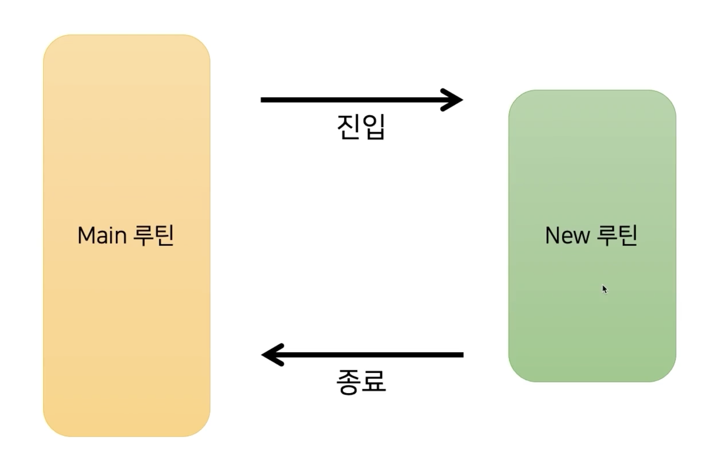
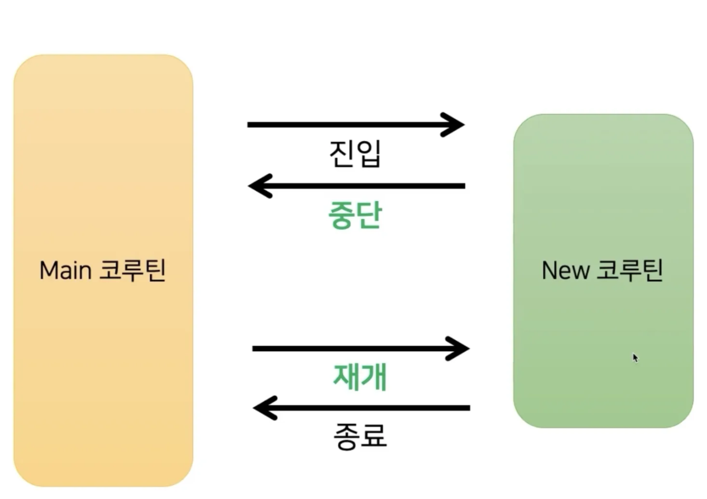
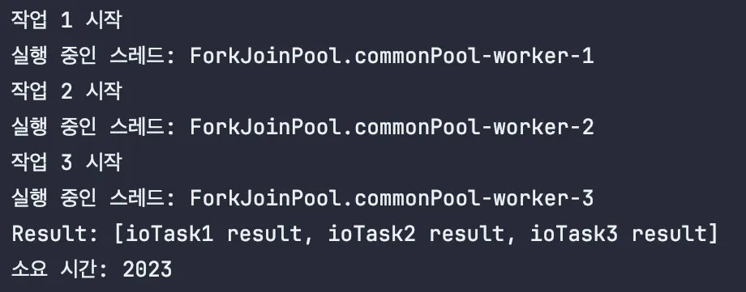

# 3주차

# 코루틴 개념, 코루틴을 왜 쓰는가?

## 코루틴이란

**코루틴은 Co(함께, 서로) + routine(규칙적 일의 순서, 작업의 집합) 2개가 합쳐진 단어로 함께 동작하며 규칙이 있는 일의 순서를 뜻함**.

> 실행의 지연과 재개를 허용함으로써,
>
>
> **비선점적 멀티태스킹**을 위한**서브 루틴**을 일반화한 컴퓨터 프로그램 구성요소
>

### 루틴?

프로그램은 여러 **루틴의 조합**으로 진행되는데, 메인 루틴과 서브 루틴으로 나뉨.

- **메인 루틴** : 프로그램 전체의 개괄적인 동작으로 **main 함수에 의해 수행되는 흐름**
- **서브 루틴** : 반복적인 기능을 모은 동작으로 **main 함수 내에서 실행되는 개별 함수의 흐름**


메인 루틴에서 함수가 실행되어 서브 루틴으로 진입한 후, 함수 동작이 완료될 때 다시 메인 루틴으로 돌아감을 표현하는 이미지

함수를 호출해서 새로운 서블 루틴으로 들어가게 되는 지점: **진입 지점**

서브 루틴에서 반환문을 통해 함수 호출부로 돌아가게 되는 지점: **반환 지점**

서브 루틴은 진입 지점, 반환 지점이 각각 한 개기 때문에

**진입 후 동작을 완료하고 반환하기 전까지 다른 작업 수행 못 함.**

### 코루틴?

**진입 지점과 반환 지점을 여러개 가질 수 있어서** 서브 루틴의 임의 지점에서 동작을 중단하고, 이후 다시 해당 지점에서부터 실행을 재개할 수 있음

**→ 전체 루틴 동작을 끝내기 전에 동작을 중단하고 다른 작업 수행 가능**

스레드 전체를 블락킹하는게 아니라 하나의 스레드 위에서 여러 코루틴을 중단/재개 할 수 있는 것



내부적으로 Continuation Passing Style(CPS, 연속 전달 방식)과 State machine을 이용하여 동작

코루틴에서 함수 호출 시 연산 결과 및 다음 수행 작업과 같은 제어 정보를 가진 **일종의 콜백 함수인 Continuation을 전달하며 각 함수의 작업이 완료되면 Continuation을 호출함** 
이를 통해 상태를 연속적으로 전달하며 컨텍스트를 유지하고 코루틴 실행 관리를 위한 State machine에 따라 코드 블록을 구분해 실행함.

→ 자세한 얘기는 두 번째 주제에서!

### 비선점적 멀티태스킹

하나의 프로세스가 CPU를 할당받으면 종료되기 전까지 다른 프로세스가 CPU를 강제로 차지할 수 없음

cf) 스레드: 선점적

따라서 코루틴은 병행성은 제공하지만, 병렬성(물리적으로 동시에)은 제공하지 않음. → 사실 코루틴은 하나의 스레드 위에서 중단/재개가 가능한 루틴을 말하기 때문에 당연한 말인 것 같다..

### 코루틴을 사용하는 이유

**코루틴 도입시 장점**

스레드보다 가벼움

가장 기본적으로 스레드보다 가벼움 → 컨텍스트 스위칭 비용 절감

가독성이 좋음

suspend 함수를 사용해서, 콜백 지옥에서 벗어남

구조화된 동시성

코루틴들 사이에서 부모-자식 관계와 같은 종속 개념이 있어, 동작 취소나 예외 전파 등을 관리하는 데 코드 줄이기 가능

# 코루틴 동작 원리, 스레드와의 차이

## 코루틴 동작 원리

Directive Style

```kotlin
fun postItem(item: Item) {
    val token = requestToken()    // -> acting
    val post = createPost(token, item)    // -> continuation
    proessPost(post)
}
```

CPS(Continuation-Passing Style) == callback

```kotlin
fun postImem(item: Item) {
    // acting의 파라미터로 continuation을 넘김 
    requestToken { token ->
        createPost(token, item) { post ->
            processPost(post)
        }
    }
}
```

callback을 사용하면 가독성이 떨어지고, 많이 사용하면 콜백 지옥에 빠지므로..

코루틴의 suspend 키워드를 통해 CPS로 동작하되, Directive Style처럼 작성할 수 있게 함

### suspend 키워드

kotlin에서 아래와 같이 suspend 키워드를 붙인 함수들은 말 그대로 중단 가능한 함수

```kotlin
suspend fun createPost(token: Token, item: Item): Post {
    ...
}
```

위 코드는 JVM이 다음과 같이 컴파일함.

Continuation이 매개변수로 생기면서 CPS 스타일로 변환됨

suspend 함수가 컴파일되면 각 중단 점에 label이 찍히게 됨

내부적으로는 switch-case처럼 바뀌게 됨 → 중간에 어떤 suspension point로도 갈 수 있게.

또, 현재까지의 연산 상태를 저장하는 객체를 생성하게 됨

함수 내에서 다른 함수를 호출할 때, 지금까지 연산했던 결과를 넘겨주고, 호출한 함수의 동작이 끝나면 재개할 지점을 넘겨줘야됨 == sm (state machine)

```kotlin
suspend fun postItem(item: Item, cont: Continuation) {
    val sm = object : CoroutineImpl { ... }
    switch(sm.label) {
        case 0:
            sm.item = item // 연산 결과 저장
            sm.label = 1 // 다음에 동작할 지점** 
            val token = requestToken(sm)
        case 1:
            val item = sm.item
            val token = sm.result as Token
            sm.label = 2
        val post = createPost(token, item, sm)
            ...
    }
}
```

requestToken()가 호출되고 동작이 완료되면 sm.resume()을 호출하게 됨 → postItem의 label1을 실행하게 됨

label1에서는 지금까지 연산된 값을 불러와서 다음 동작인 createPost()를 호출하게 됨

.. 반복

### Suspend 함수의 중단점은 어떤 기준으로 생기는 걸까?

1. suspend 함수를 호출할 때
2. 네트워크 요청, I/O 작업 등이 일어날 때
3. 코루틴 컨텍스트가 변경될 때

등

suspend 키워드를 붙인다고 모두 중단하는 것이 아니라, 중단 “가능”할 뿐

ex) 단순 연산만 반복하는 함수는 자동으로 중단하지 않음 → delay, yield 등을 이용해서 명시적으로 중단 지점을 사용해야됨

## 코루틴 vs 스레드

### 코루틴


cooperatively multitasked
(협력적 멀티태스킹)

코루틴이 자발적으로 제어권을 넘김

동시성을 제공하지만 병렬성은 제공하지 않음.

코루틴 간 전환에는 system call이 불필요함 → 뮤텍스, 세마포어 등 동기화 작업 필요 X == 운영체제 지원 필요 X

### 스레드


preemptively multitasked

(선점적 멀티태스킹)

스레드는 시분할이 끝나면 강제로 제어권이 넘어감

# 실습

- api 하나 만드는데, io작업 3개 이상이 있다.
- 3개를 동시에 실행시키고, 동시에 완료된 이후에 return하도록 코루틴을 기반으로 구성.
- 하나는 스레드 기반으로 해보기~

### 코루틴

```kotlin
import kotlinx.coroutines.async
import kotlinx.coroutines.delay
import kotlinx.coroutines.runBlocking
import kotlin.system.measureTimeMillis

fun main() = runBlocking {
    val timeTaken = measureTimeMillis {
        val task1 = async { ioTask1() }
        val task2 = async { ioTask2() }
        val task3 = async { ioTask3() }

        val results = listOf(task1.await(), task2.await(), task3.await())
        println("Result: $results")

    }

    println("소요 시간: $timeTaken")
}

suspend fun ioTask1(): String {
    println("작업 1 시작")
    println("실행 중인 스레드: ${Thread.currentThread().name}")
    delay(1000)
    return "ioTask1 result"
}

suspend fun **ioTask2 * *(): String {
    println("작업 2 시작")
    println("실행 중인 스레드: ${Thread.currentThread().name}")
    delay(1500)
    return "ioTask2 result"
}

suspend fun **ioTask3 * *(): String {
    println("작업 3 시작")
    println("실행 중인 스레드: ${Thread.currentThread().name}")
    delay(2000)
    return "ioTask3 result"
}
```


### 스레드

```kotlin
import java.util.concurrent.CompletableFuture
import kotlin.system.measureTimeMillis

fun main() {
    val timeMilies = measureTimeMillis {
        val task1 = CompletableFuture.supplyAsync { nonSuspendIoTask1() }
        val task2 = CompletableFuture.supplyAsync { nonSuspendIoTask2() }
        val task3 = CompletableFuture.supplyAsync { nonSuspendIoTask3() }

        val allTasks = CompletableFuture.allOf(task1, task2, task3)

        val result = allTasks.thenApply {
            listOf(task1.join(), task2.join(), task3.join())
        }

        println("Result: ${result.get()}")
    }

    println("소요 시간: $timeMilies")

}

fun nonSuspendIoTask1(): String {
    println("작업 1 시작")
    println("실행 중인 스레드: ${Thread.currentThread().name}")
    Thread.sleep(1000)
    return "ioTask1 result"
}

fun nonSuspendIoTask2(): String {
    println("작업 2 시작")
    println("실행 중인 스레드: ${Thread.currentThread().name}")
    Thread.sleep(1500)
    return "ioTask2 result"
}

fun nonSuspendIoTask3(): String {
    println("작업 3 시작")
    println("실행 중인 스레드: ${Thread.currentThread().name}")
    Thread.sleep(2000)
    return "ioTask3 result"
}

```



동작이 복잡하지 않아서, 걸리는 시간은 비슷하지만

코루틴은 스레드 생성 없이 동시 처리하는 것을 확인할 수 있음