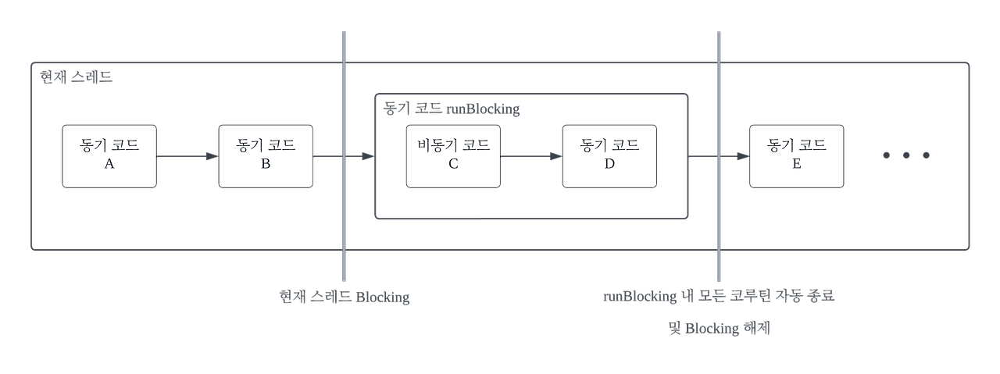
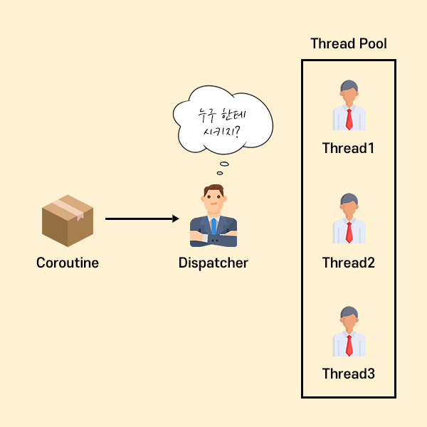
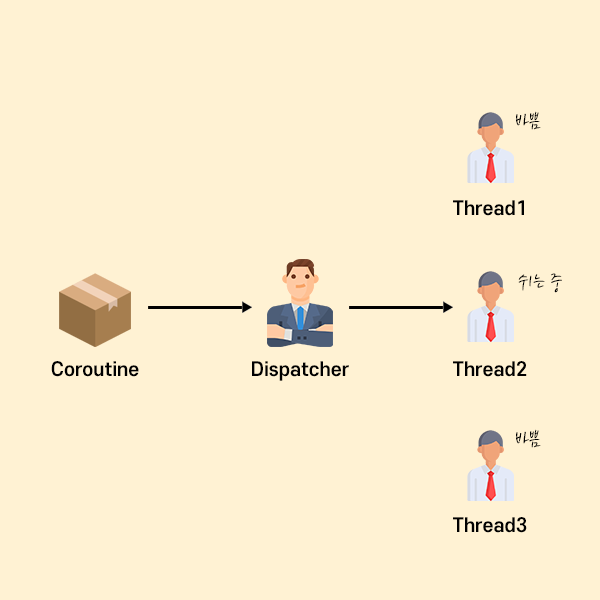

## continuation, Dispatchers, async, launch, suspend, coroutineScope, coroutineContext, yield, runBlocking, withContext 키워드 정의

## suspend

suspend는 코루틴에서 사용되는 함수가 `일시 중단될 수` 있다는 것을 나타냅니다.
일반 함수처럼 호출되지만, 호출한 코루틴을 블로킹하지 않고 다른 작업을 진행할 수 있도록 합니다.


작업 1이 작업 2의 결과를 뱉기 전에 작업 3을 실행할 수 있습니다.


suspend fun으로 선언되는 일시 중단 함수는 함수 내에 일시 중단 지점을 포함할 수 있는 특별한 함수입니다. 코루틴은 언제든지 일시 중단하고, 스레드를 양보할 수 있습니다.
일시 중단 함수는 코루틴에서 실행되는 일시 중단 지점이 포함된 코드들을 재사용할 수 있는 코드의 집합으로 만드는 역할을 수행합니다.

```kotlin
fun main() = runBlocking<Unit> {
    val startTime = System.currentTimeMillis()
    val job1 = launch {
        delayAndPrintHelloCoroutines()
    }
    val job2 = launch {
        delayAndPrintHelloCoroutines()
    }
    job1.join()
    job2.join()
    println("${System.currentTimeMillis() - startTime}") // 110 출력
}

suspend fun delayAndPrintHelloCoroutines() {
    delay(100L)
    println("Hello Coroutines")
}

```

## runBlocking

코루틴을 실행하는 가장 기본적인 방법으로, 코루틴 빌더 중 하나입니다.
이전까지 예제를 보이면서 launch, async와 같은 비동기 코드를 감싸주는 포장지 같은 역할이다.
runBlocking은 현재 스레드를 블로킹하며, 내부에서 코루틴을 실행합니다. 테스트 또는 메인 함수에서 간단히 코루틴을 실행할 때 주로 사용됩니다.
스레드를 블로킹하므로 프로덕션 코드에서는 권장되지 않지만, 진입점에서 코루틴을 실행해야 할 때 유용합니다.



```kotlin
fun main() = runBlocking {
    println("Start") // 즉시 실행
    delay(5000) // 5초 대기 (코루틴)
    println("End") // 5초 후 실행
}
```

## launch

새로운 코루틴을 생성하는 빌더로, 반환값이 없는 작업에 적합합니다.
백그라운드에서 실행되며, Job 객체를 반환합니다.

결과를 반환하지 않는 launch는 결과를 반환하지 않고, launch 수행 시 job이 반환된다.

```kotlin
fun main() = runBlocking {
    println("Start")

    launch {
        delay(1000) // 1초 대기
        println("Task 1 completed")
    }

    launch {
        delay(500) // 0.5초 대기
        println("Task 2 completed")
    }

    println("End")
    val job: Job = launch { println(1) }
    job.join()
    println(2)
}


```

## async

반환값이 있는 작업을 수행할 때 사용하는 코루틴 빌더입니다.
async는 결과를 반환하며 결과값은 Deferred로 감싸서 반환됩니다. Deferred는 미래에 올 수 있는 값을 담아놓을 수 있는 객체입니다. 결과를 가져오려면 await()를 호출해야 합니다.

```kotlin
fun main() = runBlocking {
    val deferredInt: Deferred<Int> = async {
        1 // 마지막 줄 반환
    }
    val value = deferredInt.await()
    println(value) // 1 출력
}
```


Deferred<T>의 await()메서드가 수행되면 await을 호출한 코루틴(위의 코드에서는 runBlocking 코루틴)은 결과가 반환되기까지 스레드를 양보하고 대기합니다. 우리는 이를 코루틴이 `일시 중단`되었다고 하며 이러한 특성으로 인해 await() 메서드는 일시 중단이 가능한 코루틴 내부에서만 사용이 가능합니다.
만약 일반 함수에서 await을 사용하면 일시 중단 함수는 suspend fun(일시중단 함수)에서만 호출될 수 있다는 오류가 발생됩니다.

## withContext

withContext()는 **기존에 있는 코루틴 영역에서 관리하는 특정 실행 context만 바꾼** 코루틴 영역을 만드는 것입니다. 실제로 suspend 함수이기 때문에 또 다른 suspend 함수에서만 실행할 수 있다는 것이 특징입니다. 보통은 기존에 코루틴 영역이 있는데 Dispatcher와 같은 특정 context element만 바꾸고 싶을 때 사용합니다.

코루틴의 컨텍스트를 변경하여 특정 블록의 코드를 다른 디스패처에서 실행할 수 있습니다.
입출력 작업(I/O)이나 CPU 집약적인 작업을 다른 디스패처에서 처리하고, 메인 스레드의 부하를 줄일 수 있는데, 주로 입출력 작업(Dispatchers.IO), CPU 집중 작업(Dispatchers.Default), UI 작업(Dispatchers.Main)을 구분할 때 사용됩니다.

```kotlin
// suspend 함수로 네트워크 작업 시뮬레이션
suspend fun fetchData(): String {
    return withContext(Dispatchers.IO) {  // I/O 스레드에서 실행
        println("Fetching data on: ${Thread.currentThread().name}")
        delay(3000)  // 네트워크 지연 시뮬레이션
        "Data from server"
    }
}

fun main() = runBlocking {
    println("Main program starts: ${Thread.currentThread().name}")

    // suspend 함수 호출
    val data = fetchData()
    println("Received data: $data")

    println("Main program ends: ${Thread.currentThread().name}")
}
```

1. fetchData 함수는 네트워크 작업을 비동기적으로 시뮬레이션하며, 이 작업은 Dispatchers.IO에서 실행됩니다.
2. fetchData 함수가 완료되면 데이터가 반환되고, 메인 스레드에서 결과를 처리할 수 있습니다.

입출력 작업이나 네트워크 작업을 별도의 스레드에서 처리하고, 그 작업이 끝나면 메인 스레드로 돌아와서 UI(Dispatchers.Main)를 업데이트하는 방식으로 사용됩니다.

참고: https://todaycode.tistory.com/183, https://onlyfor-me-blog.tistory.com/724, https://jinn-blog.tistory.com/194

## Dispatcher

코루틴의 실행 스레드를 결정하는 컨텍스트입니다. 대표적인 옵션으로는 Dispatchers.Main, Dispatchers.IO, Dispatchers.Default 등이 있습니다.

참고로 Thread Pool은 스레드를 정해진 개수만큼 정해놓고 작업 큐에 들어오는 작업들을 하나씩 처리합니다.
매번 스레드를 생성했다가 지웠다가 하는 게 아니라 일정 개수만큼 만들어 놓는 것입니다.


Dispatcher는 이렇게 Thread Pool 내부에서 쉬고 있는 Thread에게 작업을 할당하여
아래 그림처럼 골고루 부하 상황에 따라 코루틴을 분배한다고 합니다.



#### Dispatcher의 종류

1. Default

- 리스트를 정렬하거나, Json Parsing 작업 등에 최적화
- 무거운 연산 작업에 최적화되어 있습니다. (CPU를 많이 사용하는 작업)
- CPU 개수만큼 스레드를 생성해 작업

2. Main

- 화면 UI 작업을 하기 위해 사용

3. IO

- 네트워크, DB 작업 등에 최적화
- 읽기, 쓰기 작업에 최적화
- 스레드를 block 할 필요가 있을 때 사용
- 기본적으로 최대 64개의 Thread 생성 가능 (Custom 하여 늘릴 수 있다고 합니당)

이렇게 상황에 적합한 Dispatcher를 사용해주면 됩니다.

참고: https://todaycode.tistory.com/182

## yield

사전적 의미로 양보하라라는 의미.
현재 실행 중인 코루틴 디스패처에서 스레드를 동일한 디스패처에 있는 다른 코루틴에게 실행 권한을 넘겨줍니다.
Cooperative multitasking을 지원하기 위한 도구로 사용됩니다.

```kotlin
suspend fun exampleYield() {
    repeat(5) {
        println("Working...")
        yield() // 다른 코루틴에게 실행 권한 양보
    }
}

fun main(): Unit = runBlocking {
    launch {
        exampleYield()
    }

    launch {
        repeat(5) {
            println("Other task...")
            delay(200)
        }
    }
}
```

1. 첫 번째 launch 시작:

- exampleYield가 실행되어 “Working…” 출력.

- 첫 번째 yield() 호출 후 실행 중단, 두 번째 코루틴 실행.

2. 두 번째 launch 실행:

- “Other task…” 출력.
- elay(200)로 200ms 대기.

3. 첫 번째 launch 재개:

- 두 번째 “Working…” 출력.
- 시 yield() 호출하여 실행 중단, 두 번째 코루틴 실행.

4. 반복 진행:

- 두 코루틴이 교대로 실행되며 출력이 반복됨.

```
# 실행 결과
Working...
Other task...
Working...
Working...
Working...
Working...
Other task...
Other task...
Other task...
Other task...
```

## CoroutineScope

CoroutineScope는 코루틴을 생성하고 실행하는 범위를 정의하며 스코프 내의 모든 코루틴이 완료될 때까지 현재 코루틴을 일시 중단합니다. 스코프 내에서 launch나 async를 안전하게 사용할 수 있습니다.
스코프는 GlobalScope, CoroutineScope가 존재하며
GlobalScope는 앱의 생명주기와 함께 동작하기 때문에 별도 생명 주기 관리가 필요없으며 앱의 시작부터 종료까지 긴 시간 실행되는 코루틴에 적합합니다. (전역적으로 관리되는 영역에 사용)
CoroutineScope는 버튼을 눌러 다운로드하거나 서버와 통신한다거나 하는 등의 필요할 때만 시작, 완료되면 종료하는 용도로 사용됩니다. (API 호출 또는 스케줄링?)

이전에 보았던 async, launch도 CoroutineScope의 확장 함수들이다.

```kotlin
fun main() = runBlocking {
    launchAB()
}

private suspend fun launchAB() = coroutineScope {
    launch {
        println("launch A Start")
        delay(1000L)
        println("launch A End")
    }

    launch {
        println("launch B Start")
        delay(1000L)
        println("launch B End")
    }
    delay(500L)
    println("Hello World!")
}
```

launchAB()의 내부가 코루틴 스코프가 되어 launch를 사용할 수 있게 되었습니다. 이때 launchAB()가 일반 함수인데 runBlocking 대신에 coroutinescope를 사용하려면 launchAB()가 suspend 함수여야 하기 때문입니다. coroutineScope는 코루틴 빌더 중 하나로 코루틴 스코프를 수신 객체로 가지는 suspend 함수입니다. suspend 함수이기 때문에 suspend 함수 내에서만 호출이 가능하고 그래서 launchAB가 suspend 함수여야 하는 것입니다.

## Continuation

Continuation은 코루틴에서 일시 중단된 지점을 재개하기 위한 상태를 관리하는 객체입니다.
Kotlin에서 suspend 함수는 일시적으로 작업을 중단하고, 특정 조건이 충족되면 다시 재개됩니다. 이 과정에서 현재 작업의 상태(중단된 지점, 지역 변수 값 등)를 유지하고, 나중에 재개할 수 있도록 관리하는 역할을 Continuation이 담당합니다. 일시 중지되거나 그에 따른 상태의 객체를 표현합니다.

```kotlin
// Continuation 인터페이스
interface Continuation<in T> {
    val context: CoroutineContext
    fun resumeWith(result: Result<T>)
}
```

## CoroutineContext

코루틴의 실행 환경(Dispatcher, Job 등)에 대한 정보를 담고 있는 객체입니다. (Key-value로 구성)
특정 작업에서 컨텍스트를 설정하거나 변경할 때 사용됩니다.

```kotlin
fun main() {
    // element 조합
    CoroutineName("나만의 코루틴") + SupervisorJob()
    CoroutineName("나만의 코루틴") + Dispatchers.Default

}

suspend fun delayPrintCoroutineContext() {
    val job = CoroutineScope(Dispatchers.Default).launch {
        delay(1000)
        print("Hello")
        coroutineContext.minusKey(CoroutineName.Key)
    }
}
``` 

## CoroutineDispatcher