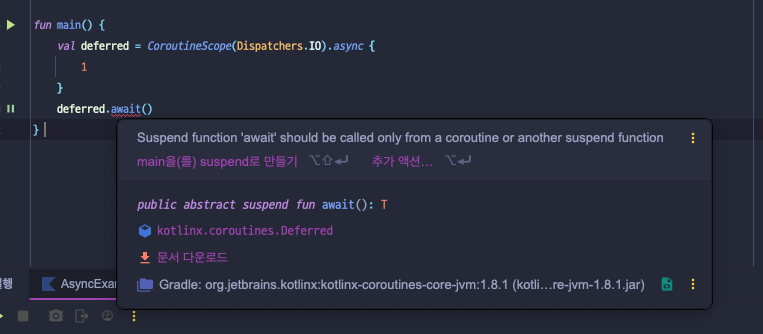

## continuation, Dispatchers, async, launch, suspend, coroutineScope, coroutineContext, yield, runBlocking, withContext 키워드 정의

## suspend

suspend는 코루틴에서 사용되는 함수가 `일시 중단될 수` 있다는 것을 나타냅니다.
일반 함수처럼 호출되지만, 호출한 코루틴을 블로킹하지 않고 다른 작업을 진행할 수 있도록 합니다.


작업 1이 작업 2의 결과를 뱉기 전에 작업 3을 실행할 수 있습니다.


suspend fun으로 선언되는 일시 중단 함수는 함수 내에 일시 중단 지점을 포함할 수 있는 특별한 함수입니다. 코루틴은 언제든지 일시 중단하고, 스레드를 양보할 수 있습니다.
일시 중단 함수는 코루틴에서 실행되는 일시 중단 지점이 포함된 코드들을 재사용할 수 있는 코드의 집합으로 만드는 역할을 수행합니다.

```kotlin
fun main() = runBlocking<Unit> {
    val startTime = System.currentTimeMillis()
    val job1 = launch {
        delayAndPrintHelloCoroutines()
    }
    val job2 = launch {
        delayAndPrintHelloCoroutines()
    }
    job1.join()
    job2.join()
    println("${System.currentTimeMillis() - startTime}") // 110 출력
}

suspend fun delayAndPrintHelloCoroutines() {
    delay(100L)
    println("Hello Coroutines")
}

```

## runBlocking

코루틴을 실행하는 가장 기본적인 방법으로, 코루틴 빌더 중 하나입니다.
이전까지 예제를 보이면서 launch, async와 같은 비동기 코드를 감싸주는 포장지 같은 역할이다.
runBlocking은 현재 스레드를 블로킹하며, 내부에서 코루틴을 실행합니다. 테스트 또는 메인 함수에서 간단히 코루틴을 실행할 때 주로 사용됩니다.
스레드를 블로킹하므로 프로덕션 코드에서는 권장되지 않지만, 진입점에서 코루틴을 실행해야 할 때 유용합니다.


```kotlin
fun main() = runBlocking {
    println("Start") // 즉시 실행
    delay(5000) // 5초 대기 (코루틴)
    println("End") // 5초 후 실행
}
```

## launch

새로운 코루틴을 생성하는 빌더로, 반환값이 없는 작업에 적합합니다.
백그라운드에서 실행되며, Job 객체를 반환합니다.

결과를 반환하지 않는 launch는 결과를 반환하지 않고, launch 수행 시 job이 반환된다.

```kotlin
val job: Job = launch { println(1) }
```

## async

반환값이 있는 작업을 수행할 때 사용하는 코루틴 빌더입니다.
async는 결과를 반환하며 결과값은 Deferred로 감싸서 반환됩니다. Deferred는 미래에 올 수 있는 값을 담아놓을 수 있는 객체입니다. 결과를 가져오려면 await()를 호출해야 합니다.

```kotlin
fun main() = runBlocking {
    val deferredInt: Deferred<Int> = async {
        1 // 마지막 줄 반환
    }
    val value = deferredInt.await()
    println(value) // 1 출력
}
```



Deferred<T>의 await()메서드가 수행되면 await을 호출한 코루틴(위의 코드에서는 runBlocking 코루틴)은 결과가 반환되기까지 스레드를 양보하고 대기합니다. 우리는 이를 코루틴이 `일시 중단`되었다고 하며 이러한 특성으로 인해 await() 메서드는 일시 중단이 가능한 코루틴 내부에서만 사용이 가능합니다.
만약 일반 함수에서 await을 사용하면 일시 중단 함수는 suspend fun(일시중단 함수)에서만 호출될 수 있다는 오류가 발생됩니다.

## withContext

코루틴의 실행 컨텍스트(Dispatcher)를 변경할 때 사용됩니다.
작업 완료를 기다린 후 결과를 반환하며, 보통 suspend 함수 내에서 호출됩니다.

## Dispatchers

코루틴의 실행 스레드를 결정하는 컨텍스트입니다. 대표적인 옵션으로는 Dispatchers.Main, Dispatchers.IO, Dispatchers.Default 등이 있습니다.

## CoroutineScope

코루틴 스코프를 정의하며, 스코프 내의 모든 코루틴이 완료될 때까지 현재 코루틴을 일시 중단합니다.
스코프 내에서 launch나 async를 안전하게 사용할 수 있습니다.

## continuation

suspend 함수가 중단된 지점에서 작업을 재개하기 위한 상태를 나타냅니다.
Kotlin 내부적으로 관리되며, 개발자가 직접 사용할 일이 거의 없습니다.

## yield

현재 실행 중인 코루틴을 잠시 중단하고 다른 코루틴에게 실행 권한을 넘겨줍니다.
Cooperative multitasking을 지원하기 위한 도구로 사용됩니다.

## coroutineContext

코루틴의 실행 환경(Dispatcher, Job 등)에 대한 정보를 담고 있는 객체입니다.
특정 작업에서 컨텍스트를 설정하거나 변경할 때 사용됩니다.
