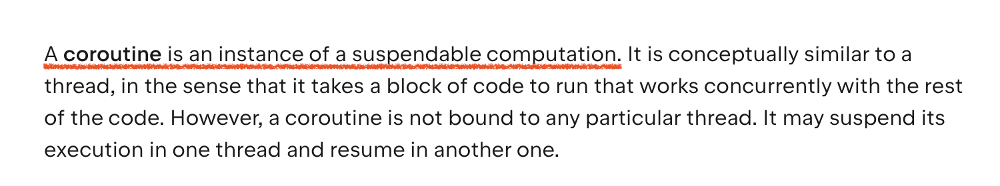
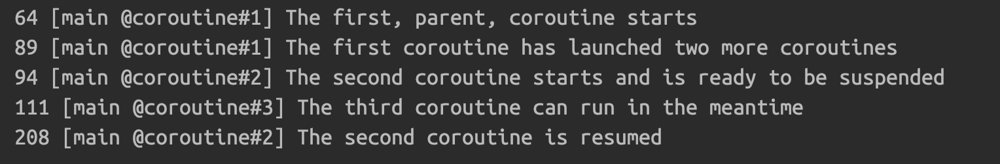

# week 4

3주차 까지 코루틴이 무엇인지, 왜 써야하는지 알아보았다. 4주차는 코루틴을 잘 쓰기 위해 코틀린이 준비한 여러가지 도구들에 대해 알아보자.

## 코루틴 생성하기

코틀린 공식 문서의 설명을 빌리자면, 코루틴은 ‘중단 가능한 연산의 인스턴스’ 이다.



어떻게보면 짤린 코드블록의 구현체 정도라고 봐도 될 것 같다. 이 코루틴이라는 친구를 편하게 생성하라고 코틀린은 아래처럼 `coroutine builder` 함수를 만들었다.

- `runBlocking`
    - blocking 코드와 코루틴을 이어주는 브릿지 역할
- `launch`
    - 값을 반환하지 않는 코루틴을 생성
- `async`
    - 값을 반환하는 코루틴을 생성

이제 이 세가지를 자세히 살펴보자.

### runBlocking

일반적인 blocking 코드에선 suspend 함수를 호출할 수 없기에 이 두가지 다른 세계를 이어줄 다리가 필요한데, 이때 `runBlocking` 함수를 사용한다. 동작은 단순하다. 

- 코루틴의 바디로 사용될 코드 블록을 함수의 인자로 넣는다.
- 코루틴을 생성하고 코드 블록을 실행한다.
- 코루틴이 완료될 때 까지 `runBlocking` 을 호출한 스레드는 대기한다.

```kotlin
import kotlinx.coroutines.*
import kotlin.time.Duration.Companion.milliseconds
 
suspend fun doSomethingSlowly() {
    delay(500.milliseconds)
    println("I'm done")
}
 
fun main() = runBlocking {
    doSomethingSlowly()
}
```

**스레드 block 안하려고 코루틴 쓰는거 아닌가요? 왜 코루틴 쓰면서 스레드를 block 하나요?**

- runBlocking 이 호출 스레드를 block 시키는건 맞지만 그렇다고 runBlocking 을 죄악처럼 여길 필요는 없다.
- 적어도 runBlocking 내부에선 수많은 코루틴을 생성할 수 있고, 이말인 즉슨 하나의 스레드로 여러 작업을 동시에 할 수 있다는 말이다.
- 스레드 여러개 쓰는 것 보다야 낫지 않을까

### launch

흔히 말하는 “start-and-forget” 의 유즈케이스에 적합하다. 실행 시키고 반환 값을 알 필요 없는 경우 사용하자.

아래 코드가 어떻게 실행될지 예상해보자. 실제로 실행 해본 결과가 내 예상과 맞는가?

```kotlin
fun main() = runBlocking {
    log("The first, parent, coroutine starts")
    launch {
        log("The second coroutine starts and is ready to be suspended")
        delay(100.milliseconds)
        log("The second coroutine is resumed")
    }
    launch {
        log("The third coroutine can run in the meantime")
    }
    log("The first coroutine has launched two more coroutines")
}

private var zeroTime = System.currentTimeMillis()
fun log(message: Any?) =
    println("${System.currentTimeMillis() - zeroTime} " +
            "[${Thread.currentThread().name}] $message")
```

스레드 정보를 출력할 때 현재 실행중인 코루틴의 정보를 보고싶으면 VM option 에 아래 옵션을 추가하자.

```kotlin
-Dkotlinx.coroutines.debug
```

코드의 실행 결과는 아래와 같다. 



코루틴 3개의 실행 흐름이 머릿속에 그려지는가? 그림으로 그려보면 아래와 같다.


main 스레드의 타임라인을 기준으로 코루틴의 동작을 그려보았다. 

1. main 스레드는 `runBlocking` 으로 코루틴을 하나 생성했다.
2. 해당 코루틴(#1)은 `launch` 함수로 두개의 자식 코루틴을 생성했다.
3. #2 코루틴은 `delay` 함수를 호출하여 잠시 중단되었다.
    1. #2 코루틴은 main 스레드를 반납했다. 
4. #3 코루틴이 실행되었다.
5. #3 코루틴 실행이 끝난 후 #2 코루틴이 재개되었다.

`launch` 함수는 앞서 말했듯 연산의 반환값에 관심이 없다. 대신 함수 자체는 `Job` 클래스를 반환하는데, 이건 **실행한 코루틴에 대한 정보를 담고있음과 동시에 코루틴을 제어할 수 있는 기능**을 제공한다. 

### async

코루틴 내에서 수행한 연산에 대한 결과가 필요할 때 `async` 함수를 사용하자. `launch` 와 비슷하게 코드 블록을 인자로 받아서 코루틴으로 실행하지만 반환값의 형태가 `Deferred<T>` 인데, 이 클래스는 `Job` 과 다르게 연산의 결과값을 담고있다.

```kotlin
suspend fun slowlyAddNumbers(a: Int, b: Int): Int {
    log("Waiting a bit before calculating $a + $b")
    delay(100.milliseconds * a)
    return a + b
}

fun main() = runBlocking {
    log("Starting the async computation")
    val myFirstDeferred = async { slowlyAddNumbers(2, 2) }    
    val mySecondDeferred = async { slowlyAddNumbers(4, 4) }   
    log("Waiting for the deferred value to be available")
    log("The first result: ${myFirstDeferred.await()}")       
    log("The second result: ${mySecondDeferred.await()}")     
}
```

앞서 `launch` 에서 했던 것 처럼 이 코드도 머릿속으로 한번 예상해본 후에 실행해보자. 


이번 코드 또한 3개의 코루틴의 흐름을 main 스레드의 타임라인 기준으로 그려보면 아래와 같다.


`Deferred` 클래스는 어떻게 보면 `Future` 혹은 `Promise` 와 많이 닮아있다. 아직 준비되지 않은 (계산되어야 할) 값을 담고 있기 때문이다.

다만 코틀린 코루틴의 `async` `await` 가 여타 다른 언어의 그것과 다른 점이라면 모든 `suspend` 함수 마다 `async` 와 `await` 를 쓸 필요가 없다는 점이다. `async` 는 반드시 ‘동시에’ 코루틴이 실행되어야 할 경우만 사용하면 된다.

## Dispatchers

`Dispatcher` 란 **코루틴이 어떤 스레드에서 실행될지 결정**하는 클래스이다. 어떤 dispatcher 를 선택하냐는 곧 이 코루틴이 어떤 스레드 (혹은 어떤 스레드 풀) 에서 실행될지를 선택하는 것과 같은 말이다. 

코루틴은 별도 선언이 없을 경우 기본적으로 부모 코루틴의 dispatcher 를 그대로 사용한다. 코루틴에서 기본적으로 제공하는 dispatcher 가 몇가지 있는데 한번 살펴보자.

- Dispatchers.Default
- Dispatchers.Main
- Dispatchers.IO

### Dispatchers.Default

- 가장 보편적으로 사용할 수 있게 만들어진 dispatcher
- CPU 코어 갯수만큼의 스레드가 생성된다.
- 코어 갯수 만큼의 동시성을 보장하는 dispatcher
- 대부분의 코루틴은 특별한 경우가 아니면 이 dispatcher 를 사용해도 무방하다.

### Dispatchers.Main

- 메인 스레드(UI 스레드)로만 구성된 dispatcher
- UI 작업에 사용하는게 좋다
- 대부분의 클라이언트 애플리케이션에서 UI 작업은 단일 스레드가 담당하기 때문
- 그래서 코루틴에서 UI 작업을 하려면 해당 단일 스레드로 한정해야한다.

### Dispatchers.IO

- blocking IO 작업에 사용하도록 의도된 dispatcher
- Dispatchers.Default 와는 설계 의도가 완전히 다르다
- 코루틴 대응이 되어있지 않은 API 호출을 한다고 생각해보자.
    - 코어가 2개인 머신에서 해당 API 를 Dispatchers.Default 로 호출
    - API 2개만 동시에 호출해도 스레드를 모두 써버려서 다른 코루틴이 작업을 할 수 없음
- 비교적 동시 호출이 많은 IO 작업의 특성을 반영한 dispatcher 가 필요하다.
- 기본적으로 스레드 64 개를 할당, 실제 스레드의 갯수는 세밀하게 조절됨
- 가령 아래처럼 DB 별로 Dispatcher 를 구성하는 방법도 가능하다.

```kotlin
// 100 threads for MySQL connection
val myMysqlDbDispatcher = Dispatchers.IO.limitedParallelism(100)
// 60 threads for MongoDB connection
val myMongoDbDispatcher = Dispatchers.IO.limitedParallelism(60)
```

## 코루틴도 동시성 문제에서 안전하지 않다.

```kotlin
fun main() {
    runBlocking {
        launch(Dispatchers.Default) {  
            var x = 0
            repeat(10_000) {
                x++
            }
            println(x)
        }
    }
}
```

위 코드의 실행 결과는 항상 10,000이다. 왜냐하면 10000번 실행되는 코드가 단 하나의 코루틴에서 실행되기 때문이다. (`Dispatchers.Default` 를 사용했음에도 불구하고)

```kotlin
“fun main() {
    runBlocking {
        var x = 0
        repeat(10_000) {
            launch(Dispatchers.Default) {  
                x++
            }
        }
        delay(1.seconds)
        println(x)
    }
}

```

반면에 위 코드의 실행 결과는 매번 다르다. 10000개의 각기 다른 코루틴을 생성했고, 이 서로 다른 코루틴들이 하나의 변수에 접근하기 때문이다.

**코루틴 그 자체로는 동시성을 의미하지 않는다는 것에 유의하자.**