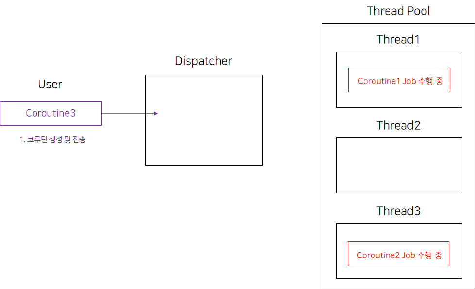

# 4주차

### Continuation

중단이 가능해야되는 suspend 함수를 동작시키기 위해 필요한 객체.

**코루틴의 실행 및 중단과 관련된 핵심적인 역할을 수행**함.

suspendable한 함수가 중단 된 다음에, 재개할 때 사용하게 되는 resumeWith()를 제공함.

```kotlin
public interface Continuation<in T> {
    public abstract val context: kotlin.coroutines.CoroutineContext

    public abstract fun resumeWith(result: kotlin.Result<T>): kotlin.Unit
}
```

코루틴 빌더가 Continuation을 생성하고, suspend 함수의 매개변수로 전달하게 됨

→ 코루틴이 중단될 때 Continuation에 정보 저장

→ Continuation.resumeWith()가 호출되며 코루틴이 재개 됨

쉽게 말하면…

게임할 때도 필요한 세이브포인트 역할을 해주는 객체!

❓Continuation.resumeWith()는 누가 호출하는 건지… 알고 싶네요…

## CoroutineScope, CoroutineContext, Dispatcher
.png)

### CoroutineScope
> 코루틴을 제어할 수 있는 범위

모든 코루틴은 Scope 내에서 실행되어야 함.

코루틴이 시작 되는 곳 & 코루틴을 관리하는 곳 & 코루틴을 끝내는 곳

### CoroutineContext
코틀린을 어떻게 처리할 것인지에 대한 정보(Element)의 집합

→ 구성하는 정보들로는 Dispatcher, Job, ExceptionHandler가 있음

실제로, 코루틴이 실행중인 작업(Job)과, Dispatcher를 저장하는 일종의 맵 형태라고 생각하면 됨.

다른 CoroutineContext를 plus하거나 minus하는 연산을 통해 **특정한 Element를 합치거나 삭제할 수 있음**.

특정 Element를 합치거나 삭제..? 예시

```kotlin
launch(Dispatchers.IO + CoroutineName("testCoroutine")) {
    // 디스패처와 코루틴 이름을 합쳐서 컨텍스트로 지정
}
```


### Dispatchers

코루틴은 어쨌든 실행되려면 스레드 위에 올라가 있어야 하는데,

> 이 때 코루틴을 어떤 스레드에서 실행할지를 정하는 것이 CoroutineDispatcher임



유저가 코루틴을 생성한 후 CoroutineDispatcher에게 보내면

.png)

CoroutineDispatcher는 스레드풀에서, 현재 사용할 수 있는 스레드에 해당 코루틴을 보냄

“보낸”다는 표현을 쓰는 이유는, Dispatcher는 코루틴을 스레드에 분배만하지, 실행하는 책임은 없기 때문

.png)


스레드는 해당 코루틴을 수행함

**코틀린 Dispatcher 종류들**

```kotlin
public object Dispatchers {
    // CPU를 많이 사용하는 작업을 실행하기 위한 디스패처
    // JVM의 공유 스레드풀을 사용하고, 사용 가능한 스레드의 최대 수는 CPU의 코어 수와 같음
    @kotlin.jvm.JvmStatic public final val Default: kotlinx.coroutines.CoroutineDispatcher /* compiled code */

    // 디스크 또는 네트워크 I/O 작업을 실행하는데 최적화 되어 있는 디스패처
    // 필요에 따라 추가적으로 스레드를 더 생성/줄이기 가능, **최대 64개**까지 생성 가능
    // Default 디스패처와 스레드를 공유함
    @kotlin.jvm.JvmStatic public final val IO: kotlinx.coroutines.CoroutineDispatcher /* compiled code */

    // UI와 상호작용을 위한 디스패처 ( coroutine-android 라이브러리에 대한 의존성이 있어야 사용 가능 )
    @kotlin.jvm.JvmStatic public final val Main: kotlinx.coroutines.MainCoroutineDispatcher /* compiled code */
        public final get

    @kotlin.jvm.JvmStatic public final val Unconfined: kotlinx.coroutines.CoroutineDispatcher /* compiled code */
}
```

launch 와 같은 Coroutine Builder에 Dispatcher를 인자로 넘겨서, Dispatcher 지정 가능

```kotlin
fun main() = runBlocking<Unit> {
    launch {   
        // 인자를 안 넘겨주면 상위 **CoroutineScope**로 부터 context 상속 받음 -> main 스레드에서 실행
        println("main runBlocking       : 나는 ${Thread.currentThread().name} 에서 돌아")
    }
    launch(Dispatchers.Unconfined) {  
        // Context를 지정하지 않겠다는 의미.
        // 해당 코루틴을 호출한 스레드에서 실행함
        // 중단점 이후 다시 재개될 때는, 재개가 호출된 스레드에서 실행됨.
        println("Unconfined             : 나는 ${Thread.currentThread().name} 에서 돌아")
    }
    launch(Dispatchers.Default) {  
        // DefaultDispatchers 등록
        println("Default                : 나는 ${Thread.currentThread().name} 에서 돌아")
    }
    launch(newSingleThreadContext("H43RO_Thread")) {  
        // 새로운 쓰레드 생성
        println("newSingleThreadContext : 나는 ${Thread.currentThread().name} 에서 돌아")
    }
}

```

```kotlin
Unconfined             : 나는 main 에서 돌아
Default                : 나는 DefaultDispatcher-worker-1 에서 돌아
newSingleThreadContext : 나는 H43RO_Thread 에서 돌아
main runBlocking       : 나는 main 에서 돌아

```

Dispatchers.Unconfined

```kotlin
fun main() = runBlocking<Unit> {
    launch(Dispatchers.Unconfined) {
        println("Unconfined             : 나는 ${Thread.currentThread().name} 에서 돌아")
        delay(500)
        println("Unconfined             : 딜레이 이후에는 ${Thread.currentThread().name} 에서 돌아")
    }
    launch {
        println("main runBlocking       : 나는 ${Thread.currentThread().name} 에서 돌아")
        delay(1000)
        println("main runBlocking       : 딜레이 이후에는 ${Thread.currentThread().name} 에서 돌아")
    }
}
```

```kotlin
Unconfined             : 나는 main 에서 돌아
main runBlocking       : 나는 main 에서 돌아
Unconfined             : 딜레이 이후에는 kotlinx.coroutines.DefaultExecutor 에서 돌아
main runBlocking       : 딜레이 이후에는 main 에서 돌아
```

Dispatcher가 설정되지 않아서, 상위로부터 스레드를 상속받은 코루틴은,
중단 지점과 상관 없이 상속받은 설정에 해당하는 스레드에서 실행함

Dispatchers.Unconfined를 디스패처로 채택하면, 해당 코루틴을 호출한 스레드를 상속받기 때문에, 중단점 이후에는 다른 스레드에서 동작할 수 있음

→ 위 결과를 보면 delay() 함수를 kotlinx.coroutines.DefaultExecutor에서 호출한 것을 알 수 있음.

이전 스레드를 그대로 이용하기 때문에 context switching 비용이 줄어듦, 빠름

하지만 어떤 스레드에서 실행될지 예상할 수 없기 때문에 스레드에 민감한 동작 (like 안드로이드 UI 그리기) 을 할 때는 위험함

### launch
코루틴 스코프의 확장함수

현재 스레드를 블락하지 않고 **새로운 코루틴을 실행**하며, 결과가 아닌 Job 객체를 반환함

```kotlin
fun main() {
	// 새로운 코루틴 실행
	val job = GlobalScope.launch {
		delay(1000L)
		println("코루틴 완료")
	}
	
	println("job 실행 여부: ${job.isActive}, job 완료 여부: ${job.isCompleted}")
	Thread.sleep(3000L)
	println("job 실행 여부: ${job.isActive}, job 완료 여부: ${job.isCompleted}")
}
```

```kotlin
job 실행 여부: true, job 완료 여부: false
코루틴 완료
job 실행 여부: false, job 완료 여부: true
```

### async
코루틴의 확장 함수

현재 스레드를 블락하지 않고 새로운 코루틴을 실행하며, 결과를 Deferred로 감싸서 반환함

```kotlin
fun main() = runBlocking {
    val deferredInt: Deferred<Int> = async {
        1
    }
    val value = deferredInt.await()
    println(value)
}
```

await()가 호출되면, await를 호출한 코루틴은 결과가 반환되기까지 스레드를 양보하고 대기(중단)함

== await()는 suspend 함수에서만 호출할 수 있음

### suspend
함수 앞에 붙이는 키워드로,  중단 가능한 함수임을 나타내고

== 중단점과 재개점이 여러개인 함수를 말함

→ 지난주 스터디 주제 자료 참고 ! !

> 중단 “가능”한 함수.
중단점이 있어야만 중단함.

### yield
다른 코루틴에게 실행을 양보하는 함수

→ 중단점을 생성하는 것

cf) delay

delay는 주어진 시간동안 실행을 양보함.

```kotlin
fun main() = {
	runBlocking {
		// 코루틴 A
		launch {
			println("1")
			yield()
			println("3")
			yield()
			println("5")
		}
		
		// 코루틴 B
		launch {
			println("2")
			delay(1000L)
			println("4")
			delay(1000L)
			println("6")
		}
	}
}
```

1
2
3
5
4
6

코루틴 A는 1 출력 후 다른 코루틴에게 스레드를 양보해서 코루틴 B의 2가 출력됨

코루틴 B는 2출력 후 1초를 기다려야해서 코루틴 A에게 스레드 양보

코루틴 A는 3을 출력 후 코루틴 B에게 스레드를 양보하지만, 아직 코루틴 B는 1초가 지나지 않아서, 다시 코루틴 A가 실행되어 5가 출력됨

코루틴 B의 남은 동작 실행됨

### runBlocking
코루틴의 실행이 끝날 때까지 현재 스레드를 블락시키는 함수

코루틴의 취지와 반대되는 역할

→ 그럼 언제 사용하는가..?

- 테스트 환경에서 코루틴을 사용하는 코드가 올바르게 동작하는지 테스트해야할 때
- 코루틴의 스코프 밖인 메인 함수에서 코루틴을 실행할 때

### withContext
코루틴 실행 도중 실행 환경을 바꿀 수 있게 해주는 함수

예시

```kotlin
fun main() = runBlocking {
	
	// IO 작업을 Dispatchers.IO에서 실행하게 해서, 입출력 작업을 별도의 스레드에서 처리할 수 있음
	val result = withContext(Dispatchers.IO) {
		delay(10000L)
	}
	
// withContext 코드 블록이 끝나면 원래의 컨텍스트로 돌아가서 나머지 코드를 실행
	
}
```

suspend 함수 중 하나기 때문에 그냥 순차적으로 코드가 실행됨


안드로이드 개발 예시를 통해 동작 방식은 이해가 됐는데.. 서버 개발할 때 언제 쓸 수 있을까는 아직 잘 모르겠음 !


**안드로이드 개발 예시**

안드로이드는 UI의 변경을 Main 스레드에서만 할 수 있음

마이페이지에서 서버 통신을 통해 받은 정보를 띄워줘야돼. → Main 스레드에서 일어남

근데 유저의 요청도 Main 스레드에서 받게 됨

⇒ Main 스레드에서 서버 통신을 하게 되면 그동안 유저의 요청을 받을 수 없음. 그래서 Main 스레드에서 서버 통신을 할 수 없게 되어 있음

1. 잘못된 코드 - 메인 스레드에서 서버 통신이 일어남

    ```kotlin
    // 1. 이메일, 비밀번호를 입력 받음
    val email: String = "greedy0110@gmail.com"
    val password: String = "0110"
        
    // 2. 이메일, 비밀번호를 기반으로 회원가입을 요청
    server.requestSignUp(email, password)
        
    // 3. 회원가입이 성공적으로 완수되면, 해당 이메일과 비밀번호를 사용해 로그인을 요청
    server.requestLogIn(email, password)
        
    // 4. 성공 메시지를 노출시킴
    successMessage.isVisible = true
    ```
    
    → 그러면, 서버 통신을 별도의 스레드에서 해보자


2. 잘못된 코드 - 동시성 보장이 되지 않음
    
    서버 통신을 별도의 스레드에서 동작해서,
    
    2, 3번 과정이 끝나기 전에 4번이 실행되어 버림
    
    ```kotlin
    // 1. 이메일, 비밀번호를 입력 받음
    val email: String = "greedy0110@gmail.com"
    val password: String = "0110"
    
    thread {
        // 2. 이메일, 비밀번호를 기반으로 회원가입을 요청
        server.requestSignUp(email, password)
            
        // 3. 회원가입이 성공적으로 완수되면, 해당 이메일과 비밀번호를 사용해 로그인을 요청
        server.requestLogIn(email, password)
    }
        
    // 4. 성공 메시지를 노출시킴
    successMessage.isVisible = true
    ```

→ 콜백을 활용하자

3. 아쉬운 코드 - 가독성이 좋지 않음

    ```kotlin
    // 1. 이메일, 비밀번호를 입력 받음
    val email: String = "greedy0110@gmail.com"
    val password: String = "0110"
    
    // 2. 이메일, 비밀번호를 기반으로 회원가입을 요청
    server.requestSignUp(email, password) {
            // 3. 회원가입이 성공적으로 완수되면, 해당 이메일과 비밀번호를 사용해 로그인을 요청
            server.requestLogIn(email, password) {
                    // 4. 성공 메시지를 노출시킴
                    successMessage.isVisible = true
            }
    }
    ```

**개선 후** withContext를 활용
    <br>
    withContext로 해당 작업을 실행할 컨텍스트를 명시하고 → 1번 문제 해결
    <br>
    순차적으로 작업을 진행하면서 → 2번 문제 해결
    <br>
    가독성이 좋음 → 3번 문제 해결
    
    ```kotlin
    suspend fun requestSignUp(email: String, password: String) {
        withContext(Dispatchers.IO) { 
            // 네트워크 
        }
    }
    
    suspend fun requestLogin(email: String, password: String) {
        withContext(Dispatchers.IO) {
            // 네트워크 통신
        }
    }
    
    uiScope.launch {
        // 1. 이메일, 비밀번호를 입력 받음
        val email: String = "greedy0110@gmail.com"
        val password: String = "0110"
            
        // 2. 이메일, 비밀번호를 기반으로 회원가입을 요청
        server.requestSignUp(email, password)
            
        // 3. 회원가입이 성공적으로 완수되면, 해당 이메일과 비밀번호를 사용해 로그인을 요청
        server.requestLogIn(email, password)
            
        // 4. 성공 메시지를 노출시킴
        successMessage.isVisible = true
    }
    ```
    
IO Thread를 통해서 네트워크 요청을 하면서, 필요한 네트워크 요청들을 순차적으로 수행하는 코드를 구현할 수 있음.
